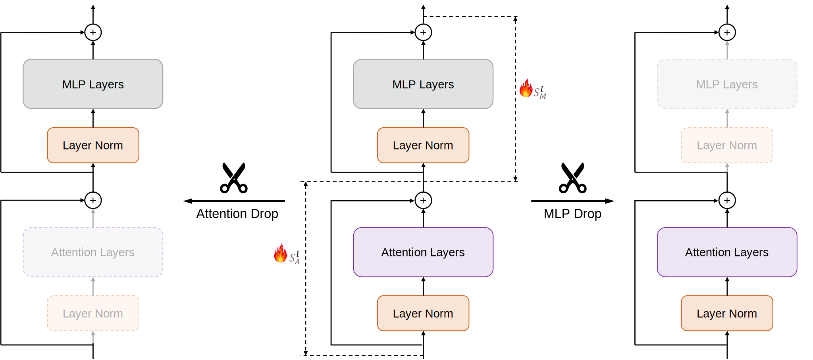

## What Matters in Transformers? Not All Attention is Needed

**[Shwai He](https://shwai-he.github.io/)\*, Guoheng Sun\*, Zheyu Shen, [Ang Li](https://www.ang-li.com/)**

**This is the official implementation of the paper [What Matters in Transformers? Not All Attention is Needed
](https://arxiv.org/abs/2406.15786).** We conduct extensive experiments and analysis to reveal the architecture redundancy within transformer-based Large Language Models (LLMs). 
Pipeline for Block Drop and Layer Drop is based on the [LLaMA-Factory](https://github.com/hiyouga/LLaMA-Factory).
The quantization is implemented based on the [AutoAWQ](https://github.com/casper-hansen/AutoAWQ) and [AutoGPTQ](https://github.com/AutoGPTQ/AutoGPTQ).

## Introduction
Transformer-based large language models (LLMs) often contain architectural redundancies. In this work, we systematically investigate redundancy across different types of modules, including Blocks, Attention layers, and MLP layers. Surprisingly, we found that attention layers, the core component of transformers, are particularly redundant. For example, in the Llama-3-70B model, **half of the attention layers can be dropped** while maintaining performance. Based on our observation.
Our observations indicate that this redundancy in Attention layers persists throughout the training process, necessitating Attention Drop.
Additionally, dropping attention layers significantly enhances computational and memory efficiency. 
Our findings are informative for the ML community and provide insights for future architecture design.



## Installation

#### Environment

```bash
conda create -n llm-drop python=3.10
conda activate llm-drop

git clone git@github.com:Shwai-He/LLM-Drop.git

#For Dropping:
cd ./LLM-Drop
pip install -e .

#For Quantization:
cd ./src/llmtuner/train/quantization/AutoAWQ
pip install -e .

cd ./src/llmtuner/train/quantization/AutoAWQ/AutoAWQ_kernels
pip install -e .

cd ./src/llmtuner/train/quantization//AutoGPTQ
pip install -vvv --no-build-isolation -e .
```

#### Prepare Models
Download the models (e.g., Mixtral-7B, Llama-2 and Llama-3) from HuggingFace. We create [new config and modeling files](https://github.com/Shwai-He/LLM-Drop/tree/main/src/llmtuner/train/prune/models) to represent the models by layers or blocks. Additionally, the key ``auto_map`` needs to be added in the config.json to utilize the new files. 
Take Mistral-7B as an example: 
```json
"auto_map": {
    "AutoConfig": "configuration_dropped_mistral.MistralConfig",
    "AutoModelForCausalLM": "modeling_dropped_mistral.MistralForCausalLM"
  },
```

## Run Dropping

#### Block Drop
```bash
bash scripts/dropping/block_drop.sh
```

#### Layer Drop
```bash
bash scripts/dropping/layer_drop.sh
```

#### Joint Layer Drop
```bash
bash scripts/dropping/layer_drop_joint.sh
```

#### Quantization
Please refer to [AutoGPTQ](https://github.com/AutoGPTQ/AutoGPTQ) and [AutoAWQ](https://github.com/casper-hansen/AutoAWQ). Ensure you carefully install the packages that correspond to your CUDA version.
For quantization, use the following scripts:
```bash
bash scripts/quantization/awq.sh
bash scripts/quantization/gptq.sh
```


#### Benchmarks

```bash
bash scripts/benchmark/benchmark_speed.py
```

TODO: Add lm-evaluation-harness here.

Please refer to [EleutherAI/lm-evaluation-harness](https://github.com/EleutherAI/lm-evaluation-harness).

Remember to use the modeling files in `src/llmtuner/model` to load the Mixtral and DeepSeek models.


## Citation

```latex
@misc{he2024matters,
      title={What Matters in Transformers? Not All Attention is Needed}, 
      author={Shwai He and Guoheng Sun and Zheyu Shen and Ang Li},
      year={2024},
      eprint={2406.15786},
      archivePrefix={arXiv},
      primaryClass={id='cs.LG' full_name='Machine Learning' is_active=True alt_name=None in_archive='cs' is_general=False description='Papers on all aspects of machine learning research (supervised, unsupervised, reinforcement learning, bandit problems, and so on) including also robustness, explanation, fairness, and methodology. cs.LG is also an appropriate primary category for applications of machine learning methods.'}
}
```

## Contact Us

If you have any questions, please contact:

- Shwai He: shwaihe@umd.edu

- Guoheng Sun: ghsun@umd.edu