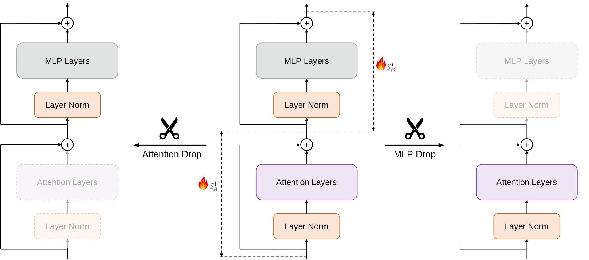

<h1 align="center">Uncovering the Redundancy in Transformers via a Unified Study of Layer Dropping</h1>

<p align="center">
  <a href="https://openreview.net/forum?id=1I7PCbOPfe"></a>
  
  
</p>

<p align="center">
  <a href="https://shwai-he.github.io/">Shwai He*</a>, <a href="https://s1ghhh.github.io/">Guoheng Sun*</a>, <a href="https://shenzheyu.github.io/">Zheyu Shen</a>, <a href="https://www.ang-li.com/">Ang Li</a>
</p>

<p align="center">
  <a href="#-news">📰 News</a> •
  <a href="#-installation">⚙️ Installation</a> •
  <a href="#-repository-layout">📦 Layout</a> •
  <a href="#-prepare-models">🧰 Models</a> •
  <a href="#-benchmark">📊 Benchmark</a> •
  <a href="#-citation">📄 Citation</a>
</p>

> This is the official implementation for the paper [**Uncovering the Redundancy in Transformers via a Unified Study of Layer Dropping**](https://openreview.net/forum?id=1I7PCbOPfe) (**TMLR**).

## 📖 Introduction

This project studies architectural redundancy in Transformer-based LLMs and provides practical pipelines for:
- Block Drop
- Layer Drop (Attention/MLP)
- Joint Layer Drop
- Post-training quantization (AWQ/GPTQ)

The dropping pipeline is built on [LLaMA-Factory](https://github.com/hiyouga/LLaMA-Factory). Quantization support is built on [AutoAWQ](https://github.com/casper-hansen/AutoAWQ) and [AutoGPTQ](https://github.com/AutoGPTQ/AutoGPTQ).



## 📰 News
- Feb 2026: This paper is published in **Transactions on Machine Learning Research (TMLR)**.
- May 2025: 🏆 Awarded the Qualcomm Innovation Fellowship (QIF) North America for the proposal *“Less Attention, Much Faster: Toward a Future of Efficiency-Optimized Transformer Architectures.”*
- Nov 2024: Added support for more model families (Gemma2, Baichuan, DeepSeek, Yi, Solar).
- Sep 2024: Released dropped-model checkpoints in this [Hugging Face collection](https://huggingface.co/collections/LLM-Drop/llm-drop-66dde616140f04eb18424a0a).
- Jun 2024: Released arXiv preprint and code.

## ⚙️ Installation

```bash
conda create -n llm-drop python=3.10 -y
conda activate llm-drop

git clone https://github.com/CASE-Lab-UMD/LLM-Drop.git
cd LLM-Drop

# Core dropping pipeline
pip install -e .

# Quantization dependencies (optional)
cd src/llmtuner/compression/quantization/AutoAWQ
pip install -e .

cd AutoAWQ_kernels
pip install -e .

cd ../../AutoGPTQ
pip install -vvv --no-build-isolation -e .

cd ../../../../../..
```

## 📦 Repository Layout

- `src/compress.py`: main entry for dropping/compression workflow.
- `scripts/dropping/*.sh`: example scripts for block/layer dropping.
- `scripts/benchmark/benchmark_lm_eval.sh`: LM-Eval benchmark script.
- `scripts/benchmark/benchmark_speed.sh`: speed benchmark wrapper.
- `src/benchmark_speed.py`: speed benchmarking implementation.
- `scripts/quantization/*.sh`: AWQ/GPTQ quantization examples.

## 🧰 Prepare Models

1. Download a base model from Hugging Face (for example `mistralai/Mistral-7B-v0.1`).
2. Add `auto_map` in the model `config.json` so Transformers can load custom dropped-model classes.
3. Set drop lists in `config.json`:

- Drop attention layers:
```json
"drop_mlp_list": [],
"drop_attn_list": [25, 26, 24, 22]
```

- Drop MLP layers:
```json
"drop_mlp_list": [26, 27, 25, 24],
"drop_attn_list": []
```

- Drop full blocks:
```json
"drop_mlp_list": [26, 25, 24, 27],
"drop_attn_list": [26, 25, 24, 27]
```

Example `auto_map` for Mistral:
```json
"auto_map": {
  "AutoConfig": "configuration_dropped_mistral.MistralConfig",
  "AutoModelForCausalLM": "modeling_dropped_mistral.MistralForCausalLM"
}
```

See model files under `src/llmtuner/compression/prune/models`.

## 🚀 Run Dropping

```bash
# Block Drop
bash scripts/dropping/block_drop.sh

# Layer Drop
bash scripts/dropping/layer_drop.sh

# Joint Layer Drop
bash scripts/dropping/layer_drop_joint.sh
```

These scripts estimate module importance, select layers/blocks to drop, and generate updated model configs/checkpoints.

## 📊 Benchmark

### 🧪 1) Task Performance

```bash
bash scripts/benchmark/benchmark_lm_eval.sh
```

Notes:
- This benchmark depends on [EleutherAI/lm-evaluation-harness](https://github.com/EleutherAI/lm-evaluation-harness).
- For strict reproduction, the repo uses this fork: [s1ghhh/lm-evaluation-harness](https://github.com/s1ghhh/lm-evaluation-harness).
- Use modeling files in `src/llmtuner/model` when loading Mistral/Llama with dropped configs.

### ⚡ 2) Inference Speed

```bash
bash scripts/benchmark/benchmark_speed.sh
```

Before running, edit placeholders in `scripts/benchmark/benchmark_speed.sh`:
- `model_path`
- `save_file`
- `model_type`

### 🧊 3) Quantization

```bash
bash scripts/quantization/awq.sh
bash scripts/quantization/gptq.sh
```

Before running, edit placeholders in those scripts (`model_path`, `quant_path`) and ensure CUDA-compatible package versions.

## 📄 Citation

```bibtex
@misc{he2024uncoveringredundancytransformers,
  title={Uncovering the Redundancy in Transformers via a Unified Study of Layer Dropping},
  author={Shwai He and Guoheng Sun and Zheyu Shen and Ang Li},
  year={2024},
  howpublished={OpenReview},
  url={https://openreview.net/forum?id=1I7PCbOPfe}
}
```

## 📬 Contact

- Shwai He: `shwaihe@umd.edu`
- Guoheng Sun: `ghsun@umd.edu`
