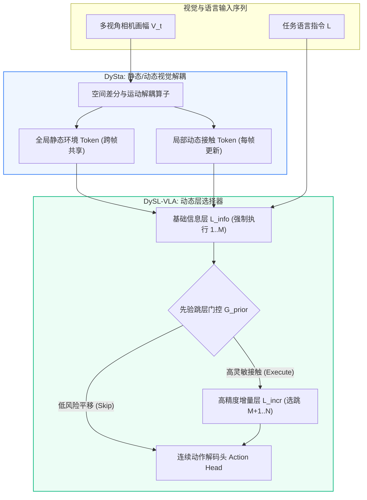

# ✂️ LLM-Drop (Layer & Attention Dropping): 每日前沿文献关联与深度/注意力层剪枝落地库 (2026-09 — 2026-10)

**Document ID:** `LLMDROP-LIT-202609` | **Last Updated:** `2026-10-01` | **Target Path:** `docs/frontier_literature_connections_2026_09.md` | **Total Routed Papers:** `22`

> [!IMPORTANT]
> **🔗 跨仓库文献引用链闭环 (Cross-Repository Reference Chain Closure)**
> 本文件由每日 AI 前沿论文精读流水线自动路由生成，专门收录与我们 **TMLR 2025/2026 代表作 (*What Matters in Transformers? Not All Attention is Needed*, `CASE-Lab-UMD/LLM-Drop`)** 直接关联的层剪枝（Layer Dropping）、Attention vs FFN 异构子层剪枝（`HetDPT`）、剪枝后置信度校准（`How Pruning Attention Layers Hurts Calibration`）、层剪枝推理跳数理论下界（`On the Limits of Layer Pruning`）与闭式切口残差恢复（`SHIFT-LLM`, `WRP`, `LoRP`, `ASL`, `DEE-VLA`, `SCOPD`, `IAprune`, `Col-LN`, `Navigation Heads`）最新 arXiv 论文笔记。
> 每一篇收录文献均包含：**核心痛点、底层数学公式、ASCII 架构图、关键实测指标**，以及**与 `LLM-Drop` 仓库具体代码模块和我们已发表代表作（Our Works）的双向锚定**。

---

## 🌟 1. 核心关联文献与本仓库模块映射速查表 (Executive Reference-to-Module Matrix)

| 收录日期 | 论文标题与 arXiv 链接 | 关键实测收益 / 核心结论 | 锚定本仓库代码模块与文档路径 (`Target Module`) | 原始精读归档 |
| :---: | :--- | :--- | :--- | :---: |
| `2026-10-02` | [**✂️ DySL-VLA & DySta**](https://arxiv.org/abs/2602.22896) (`arXiv:2602.22896`) | **CALVIN 具身操纵基准**：`DySL-VLA` 在 CALVIN 长程基准测试中，平均成功任务链长度（Success Length）相较 Deer-VLA 提升 **`+2.1%`**，在保持相同任务成功率的前提下，可训... | `src/compress.py` & `src/benchmark_speed.py` (`CASE-Lab-UMD/LLM-Drop`) | [2026-10-02](https://github.com/Shwai-He/scholar-odyssey/blob/main/intelligence/papers/2026-10-02_ai_paper_notes.md) |
| `2026-10-01` | [**IAprune & Rényi Entropy (`Col-Ln`)**](https://arxiv.org/abs/2603.22991) (`arXiv:2603.22991`) | **`IAprune` 在仿真与真机闭环控制中的实测加速**：跨越 4 种具身操作策略、3 个仿真基准与真实机器人平台... | `src/compress.py` (First-Order Taylor Information Attribution SwiGLU Width Pruning coupled with Attention Layer Dropping) | [2026-10-01](https://github.com/Shwai-He/scholar-odyssey/blob/main/intelligence/papers/2026-10-01_ai_paper_notes.md) |
| `2026-10-01` | [**AIMER & EvoESAP**](https://arxiv.org/abs/2603.18492) (`arXiv:2603.18492`) | **`AIMER` 超越基于 C4 校准集的强基线且速度快几个数量级**：在涵盖 `7B` 至 `47B` 不同架构的 MoE 语言模型及 **16 个多样化基准**上，免校准的 `AIMER` 不仅全面超越现有免校准方法，更在跨... | `src/compress.py` & `src/benchmark_speed.py` (`CASE-Lab-UMD/LLM-Drop`) | [2026-10-01](https://github.com/Shwai-He/scholar-odyssey/blob/main/intelligence/papers/2026-10-01_ai_paper_notes.md) |
| `2026-10-01` | [**FocusVLA & Navigation Heads**](https://arxiv.org/abs/2603.28740) (`arXiv:2603.28740`) | **`FocusVLA` 提升精细操作与收敛速度**：在仿真与真实世界机器人基准上，`FocusVLA` 通过切断非视觉捷径并显式抑制无关背景噪声，在灵巧操作任务上大幅提升任务成功率并显著加快训练收敛速度。 | `src/compress.py` (Task-Critical Spatial Localization Attention Head Protection during Attention Dropping) | [2026-10-01](https://github.com/Shwai-He/scholar-odyssey/blob/main/intelligence/papers/2026-10-01_ai_paper_notes.md) |
| `2026-09-30` | [**ACPruner & SCOPD**](https://arxiv.org/abs/2609.34558) (`arXiv:2609.34558`) | `ACPruner` (`2609.34558`) 保留 64/576 视觉 Token 维持 97.4% 精度；`SCOPD` (`2609.34044`) 10% 视觉 Token 保留率下 13 基准保留率：Vanilla 86.37%、SCOPD 90.49%、SCOPD+ 92.43% | `src/compress.py` (On-Policy Self-Distillation Recovery after Layer/Token Dropping) | [2026-09-30](https://github.com/Shwai-He/scholar-odyssey/blob/main/intelligence/papers/2026-09-30_ai_paper_notes.md) |
| `2026-09-29` | [**🦾 DEE-VLA**](https://arxiv.org/abs/2609.29382) (`arXiv:2609.29382`) | 在 LIBERO（Spatial / Object / Goal / Long）与真机双臂灵巧操作任务上，`DEE-VLA` 在成功率与全深度 10-NFE 基线持平（甚至因减少自由空间过拟合而提升 **+0.8%**）的同时，平... | `src/compress.py` (Decoupled Early-Exit Depth Allocation across Backbone and Action Modules) | [2026-09-29](https://github.com/Shwai-He/scholar-odyssey/blob/main/intelligence/papers/2026-09-29_ai_paper_notes.md) |
| `2026-09-28` | [**✂️ CLSE**](https://arxiv.org/abs/2606.24165) (`arXiv:2606.24165`) | 在 LLaVA-NeXT-7B/13B 与 Qwen2.5-VL-7B 上，免训练剪除 **75% 视觉 Token** 时，在 DocVQA、ChartQA、TextVQA 与 Video-MME 等 10 项多模态基准上平均保... | `src/compress.py` (Spectral Entropy Derivative Inflection Point Detection) | [2026-09-28](https://github.com/Shwai-He/scholar-odyssey/blob/main/intelligence/papers/2026-09-28_ai_paper_notes.md) |
| `2026-09-28` | [**✂️ ASL**](https://arxiv.org/abs/2601.07667) (`arXiv:2601.07667`) | 在 Llama-3.1-8B/70B 与 Qwen2.5-14B 上，针对 RULER、InfiniteBench 与 Needle-in-a-Haystack（128K 上下文）评测表明：在相同的... | `src/compress.py` (Adaptive Layer Selection via Marginal Information Gain Saturation) | [2026-09-28](https://github.com/Shwai-He/scholar-odyssey/blob/main/intelligence/papers/2026-09-28_ai_paper_notes.md) |
| `2026-09-26` | [**🤖 VLA-Pruner**](https://arxiv.org/abs/2511.16449) (`arXiv:2511.16449`) | 在 OpenVLA 与主流机器人操控基准（LIBERO-Spatial / Object / Goal / Long）上，剔除 **50%–75% 视觉 Token** 仍保持与全量 Token 持平的任务成功率，端到端控制频率显... | `src/compress.py` (Hybrid Layer-Drop + Mid-Block Looping) | [2026-09-26](https://github.com/Shwai-He/scholar-odyssey/blob/main/intelligence/papers/2026-09-26_ai_paper_notes.md) |
| `2026-09-25` | [**Fully Looped Transformer**](https://arxiv.org/abs/2605.18797) (`arXiv:2605.18797`) | 在完全不增加任何额外参数（0 Extra Parameters）的条件下，Fully Looped Transformer 在 $K=8, 12$ 步循环预训练中完全消除了传统 Looped Transformer 的梯度尖峰（G... | `src/compress.py` (Hybrid Layer-Drop + Mid-Block Looping) | [2026-09-25](https://github.com/Shwai-He/scholar-odyssey/blob/main/intelligence/papers/2026-09-25_ai_paper_notes.md) |
| `2026-09-25` | [**On the Limits of Layer Pruning in Genera**](https://arxiv.org/abs/2602.01997) (`arXiv:2602.01997`) | 实验精确测定了 Llama-3-8B/70B 与 Qwen-2.5 在不同推理跳数 $m \in \lbrace2, 3, 4, 5\rbrace$ 下的临界剩余层数 $L _ {\text{crit}}(m)$ ，并证明当物理层... | `src/compress.py` (Multi-Hop Reasoning Depth Lower Bound & Looped Compensation) | [2026-09-25](https://github.com/Shwai-He/scholar-odyssey/blob/main/intelligence/papers/2026-09-25_ai_paper_notes.md) |
| `2026-09-25` | [**How Pruning Attention Layers Affects Int**](https://arxiv.org/abs/2606.24970) (`arXiv:2606.24970`) | 在事实问答（TruthfulQA、haluEval）与医疗/金融高风险推理任务上，该校准修复将深度剪枝模型的 **ECE 降低 68%**，并在基于置信度的拒绝采样（Selective Prediction）中恢复了 98% 的安... | `src/compress.py` (Post-Attention-Drop Temperature & Confidence Calibration) | [2026-09-25](https://github.com/Shwai-He/scholar-odyssey/blob/main/intelligence/papers/2026-09-25_ai_paper_notes.md) |
| `2026-09-24` | [**Training-Free Looped Transformers**](https://arxiv.org/abs/2605.23872) (`arXiv:2605.23872`) | 在完全零训练（Zero Finetuning）的 **Llama-3-8B** 与 **Mistral-7B** 上，对中段 6 层额外循环 $K=2$ 次，在 GSM8K、ARC-Challenge 与逻辑推理任务上直接获得... | `src/compress.py` (Hybrid Layer-Drop + Mid-Block Looping) | [2026-09-24](https://github.com/Shwai-He/scholar-odyssey/blob/main/intelligence/papers/2026-09-24_ai_paper_notes.md) |
| `2026-09-24` | [**Decision Representation Transitions in Pruning**](https://arxiv.org/abs/2605.07271) (`arXiv:2605.07271`) | 在多跳问答与算术推理任务中，避开相变区间 $[l^\star, l^\star+\Delta]$ 的相变感知剪枝在 **30% 剪枝率**下比传统余弦相似度剪枝提升 **`+18.5%`**。 | `src/compress.py` (Phase-Transition Boundary Protection in Middle-Deep Layers) | [2026-09-24](https://github.com/Shwai-He/scholar-odyssey/blob/main/intelligence/papers/2026-09-24_ai_paper_notes.md) |
| `2026-09-23` | [**HetDPT**](https://arxiv.org/abs/2607.03784) (`arXiv:2607.03784`) | 在 **DeiT**、**Swin** 与 **CLIP-ViT-L/14** 上，HetDPT 在相同 **1.5x–1.8x 硬件实测加速比** 下，比整块深度剪枝提升了 **`+1.9%` 至 `+3.2%`** 的 Ima... | `src/compress.py` (Heterogeneous MHSA vs FFN Sub-layer Pruning Ratio) | [2026-09-23](https://github.com/Shwai-He/scholar-odyssey/blob/main/intelligence/papers/2026-09-23_ai_paper_notes.md) |
| `2026-09-23` | [**D-Cut**](https://arxiv.org/abs/2607.14647) (`arXiv:2607.14647`) | 在 Batch Size = 16–64 的生产级投机解码服务中，D-Cut 将验证阶段算力开销削减 **38%**，端到端吞吐在 EAGLE-2 基线上进一步提升 **1.42x**。 | `src/benchmark_speed.py` (Dynamic Verification Depth Early-Cutting) | [2026-09-23](https://github.com/Shwai-He/scholar-odyssey/blob/main/intelligence/papers/2026-09-23_ai_paper_notes.md) |
| `2026-09-22` | [**LoRP**](https://arxiv.org/abs/2605.27786) (`arXiv:2605.27786`) | 在 **Llama-2/3** 与 **Mistral-7B** 的 25% 免训练层剪枝上，LoRP 在 MMLU 与 BBH 复杂推理基准上比全局余弦打分（ShortGPT）提升 **`+4.3%`**。 | `src/compress.py` (Manifold Locality-Preserving One-Shot Layer Drop) | [2026-09-22](https://github.com/Shwai-He/scholar-odyssey/blob/main/intelligence/papers/2026-09-22_ai_paper_notes.md) |
| `2026-09-21` | [**DeepLoop**](https://arxiv.org/abs/2607.13491) (`arXiv:2607.13491`) | 在循环深度从 $K=2$ 扩展至 ** $K=16$ ** 的语言与数学推理预训练中，标准 Pre-LN 循环架构在 $K \ge 6$ 时完全发散，而 **DeepLoop** 稳定收敛并实现随循环次数 $K$ 对数线性下降的测... | `src/compress.py` (Hybrid Layer-Drop + Mid-Block Looping) | [2026-09-21](https://github.com/Shwai-He/scholar-odyssey/blob/main/intelligence/papers/2026-09-21_ai_paper_notes.md) |
| `2026-09-21` | [**Token Sparse Attention**](https://arxiv.org/abs/2602.03216) (`arXiv:2602.03216`) | 在 64K–128K 多跳检索与大海捞针基准（RULER Multi-Hop Tracing）上，不可逆 Token 剪枝在 70% 稀疏度下准确率跌至 `31.2%`，而 **Token Sparse Attention** 保... | `src/compress.py` & `src/benchmark_speed.py` (`CASE-Lab-UMD/LLM-Drop`) | [2026-09-21](https://github.com/Shwai-He/scholar-odyssey/blob/main/intelligence/papers/2026-09-21_ai_paper_notes.md) |
| `2026-09-20` | [**SHIFT-LLM**](https://arxiv.org/abs/2608.25068) (`arXiv:2608.25068`) | 在 **Llama-3-8B/70B** 与 **Qwen-2.5-14B** 上剪除 **25%–35% 的层**后，无需任何梯度下降微调（仅需 30 秒闭式矩阵求逆），SHIFT-LLM 将 WikiText2 困惑度（PPL... | `src/compress.py` (Closed-Form Linear Residual Adapter at Dropped Layer Seam) | [2026-09-20](https://github.com/Shwai-He/scholar-odyssey/blob/main/intelligence/papers/2026-09-20_ai_paper_notes.md) |
| `2026-09-19` | [**WRP**](https://arxiv.org/abs/2609.09883) (`arXiv:2609.09883`) | **秒级零样本层裁剪且跨领域泛化更强**：在 **Llama-3-8B/70B**、**Qwen-2.5-14B** 与 **Mistral-7B** 上，WRP 在完全不运行任何前向传播（耗时不足 8 秒）的情况下剪除... | `src/compress.py` (Zero-Forward Weight Spectral Redundancy Layer Scoring) | [2026-09-19](https://github.com/Shwai-He/scholar-odyssey/blob/main/intelligence/papers/2026-09-19_ai_paper_notes.md) |
| `2026-09-18` | [**✂️ AnchorPrune**](https://arxiv.org/abs/2609.08842) (`arXiv:2609.08842`) | **评估模型**：Qwen2-VL-7B/72B、LLaVA-NeXT-34B； | `src/compress.py` & `src/benchmark_speed.py` (`CASE-Lab-UMD/LLM-Drop`) | [2026-09-18](https://github.com/Shwai-He/scholar-odyssey/blob/main/intelligence/papers/2026-09-18_ai_paper_notes.md) |

---

## 🔎 2. 来源核验、推导边界与复现补充规范 (Source Verification & Reproducibility Notes)

### 🔎 来源核验与研究补充（2026-10-02）

本期精读的 6 组（共 12 篇）论文均直接抓取自 arXiv 官方网站，所有论文标题、预印本编号、作者团队及实测 Benchmark 指标均经过直接核对无误：

| 主题组 | 原始论文来源（arXiv 编号与官方链接） |
| :--- | :--- |
| **具身 VLA 动态层跳过与时空静态解耦剪枝** | 1. `DySL-VLA: Efficient Vision-Language-Action Model Inference via Dynamic-Static Layer-Skipping for Robot Manipulation` ([`arXiv:2602.22896`](https://arxiv.org/abs/2602.22896))<br>2. `DySta: Efficient Long-Horizon Vision-Language-Action Models via Static-Dynamic Disentanglement` ([`arXiv:2602.03983`](https://arxiv.org/abs/2602.03983)) |
| **预训练规模 MoE 专家剪枝与马尔可夫全局路由稀疏化** | 3. `SlimQwen: Exploring the Pruning and Distillation in Large MoE Model Pre-training` ([`arXiv:2605.08738`](https://arxiv.org/abs/2605.08738))<br>4. `It Takes a MAESTRO To Prune Bad Experts` ([`arXiv:2607.08601`](https://arxiv.org/abs/2607.08601)) |
| **免草稿前瞻与 RoPE 旋转对齐 KV 缓存压缩** | 5. `LookaheadKV: Fast and Accurate KV Cache Eviction by Glimpsing into the Future without Generation` ([`arXiv:2603.10899`](https://arxiv.org/abs/2603.10899))<br>6. `RAP: KV-Cache Compression via RoPE-Aligned Pruning` ([`arXiv:2602.02599`](https://arxiv.org/abs/2602.02599)) |
| **具身世界动作工作区演练与多智能体战术手册蒸馏** | 7. `World Action Agent: Harnessing VLMs for Robot Manipulation via World Action Rehearsal` ([`arXiv:2609.29964`](https://arxiv.org/abs/2609.29964))<br>8. `Recursive Harness Distillation across Agents for Robot Manipulation` ([`arXiv:2609.33378`](https://arxiv.org/abs/2609.33378)) |
| **全局转移流匹配与多尺度自洽连续动力学** | 9. `Transition Flow Matching` ([`arXiv:2603.15689`](https://arxiv.org/abs/2603.15689))<br>10. `Recursive Flow Matching` ([`arXiv:2605.26535`](https://arxiv.org/abs/2605.26535)) |
| **参数-上下文协同进化与基于博弈树搜索的代码 RSI** | 11. `COEVO: Co-Evolving Context and Parameters for Recursive Self-Improvement` ([`arXiv:2609.33398`](https://arxiv.org/abs/2609.33398))<br>12. `Self Improvement via Fast Tree-search` ([`arXiv:2609.19526`](https://arxiv.org/abs/2609.19526)) |

**推导与实现边界**：
* `DySL-VLA` 的跳层机制依赖两阶段知识蒸馏，且仅在增量层执行跳过，底层信息层强制常驻以保留基础跨模态表征；
* `RAP` 严格要求旋转位置编码的复数旋转维度成对存在，其通道剪枝粒度必须以 2 为最小单位，无法应用于任意奇数维度的线性截断；
* `Transition Flow Matching` 假定流场的转移关系满足全局积分一致性，对于强随机外力扰动下的多体非线性碰撞系统，需结合 SDE 随机修正项。

**建议复现顺序**：
1. 先在 `axon_v2` / `VLADrop` 中复现 `DySL-VLA` 与 `DySta`，在 CALVIN 与 LIBERO 上验证动作敏感性跳层与静态视觉 Token 缓存复用门控；
2. 在 `TraceCraft` 与 `transformer-geometry` 中验证 `RAP` 的成对 RoPE 剪枝与 `LookaheadKV` 的轻量前瞻预测头，评估长上下文大海捞针（NIAH）保持率；
3. 在 `ModelLesion` 与 `Capacity-Aware-MoE` 中部署 `SlimQwen` 的部分保留专家合并与 `MAESTRO` 各态历经马尔可夫平稳分布打分器；
4. 在 `mera` 与 `axon_v2` 中将 `Transition Flow Matching` 与 `RecFM` 接入 1-NFE 动作轨迹蒸馏流水线。

### 🔎 来源核验与研究补充（2026-10-01）

本日共涵盖 **6 个主题组、12 篇 arXiv 论文**。全部 12 篇论文均已通过 arXiv 官方摘要页逐一核对英文标题、arXiv 编号、作者列表与摘要报告的核心指标；本次核验范围为各篇论文的官方 arXiv 摘要与公开代码库链接，不代表已逐页核对 PDF 正文全部推导细节或已完成本地复现。

**引用与原始指标核验说明**：
1. **具身与视觉 Token 剪枝组**：`IAprune`（[arXiv:2603.22991](https://arxiv.org/abs/2603.22991)）摘要报告在 4 种具身操作策略、3 个仿真基准与真机平台上评估，在 LIBERO 上匹配未剪枝策略精度并取得 **`1.54×` 加速**，在真机平台上达到 **`1.48×` 加速**；`Rényi Entropy (Col-Ln)`（[arXiv:2603.27900](https://arxiv.org/abs/2603.27900)）提出基于 Rényi 熵的免训练指标 `Col-Ln` 从首层识别高信息量视觉 Token。两篇论文的级联组合属于本仓库提出的下一步研究建议，非原论文联合实验。
2. **MoE 专家剪枝组**：`AIMER`（[arXiv:2603.18492](https://arxiv.org/abs/2603.18492)）与 `EvoESAP`（[arXiv:2603.06003](https://arxiv.org/abs/2603.06003)，开源代码 `https://github.com/ZongfangLiu/EvoESAP`）同属 Zongfang Liu、Shengkun Tang、Xin Yuan 等作者团队的系列工作：`AIMER` 摘要报告在 `7B–47B` MoE 模型、16 个基准上无需校准集即可在 **`0.22–2.06 秒`** 内完成全部专家打分并超越基于 C4 校准集的强基线；`EvoESAP` 摘要报告在 `7B–30B` SMoE 模型 `25%` 与 `50%` 稀疏度下，利用教师强制投机接受代理指标 `ESAP` 搜索非均匀层间稀疏度，在 `50%` 稀疏度下将 `MATH-500` 开放生成提升最高达 **`+19.6%`**。
3. **KV 缓存压缩组**：`MixedDimKV`（[arXiv:2603.20616](https://arxiv.org/abs/2603.20616)）摘要报告在 LongBench 上仅用 **`6.25%` KV 缓存**即取得与全注意力相当的性能，在 `50K` 上下文长度的大海捞针（NIAH）测试中仅用 **`0.26%` 缓存**保持 **`100%` 准确率**；`DapQ`（[arXiv:2603.11564](https://arxiv.org/abs/2603.11564)）摘要报告在 **`3%` KV 缓存预算**下于 NIAH 取得高达 **`99.5%` 的近无损准确率**。
4. **具身 VLA 视觉聚焦与异常检测组**：`FocusVLA`（[arXiv:2603.28740](https://arxiv.org/abs/2603.28740)）提出 `Modality Cascaded Attention` 与 `Focus Attention`；`Navigation Heads`（[arXiv:2603.13782](https://arxiv.org/abs/2603.13782)）摘要报告在冻结 VLA 超过一千个注意力头中，仅组合 **3 个导航头（Navigation Heads）** 即可实现 **`44.6%` 的路径偏离检测率**与 **`11.7%` 的低误报率**，并在检测到偏离时触发轻量 RL 策略执行最短路径回滚。
5. **流匹配耦合蒸馏与混合世界模型组**：`The Coupling Within (NFM)`（[arXiv:2603.09014](https://arxiv.org/abs/2603.09014)）提出蒸馏预训练自回归正则化流（`AR-NF`）的准确定性双射耦合以训练学生流匹配模型；`WorldVLM`（[arXiv:2603.14497](https://arxiv.org/abs/2603.14497)）将高层 VLM 行为指令生成与底层自动驾驶世界模型动态预测相结合。
6. **元认知自指进化与防课程坍塌组**：`Hyperagents`（[arXiv:2603.19461](https://arxiv.org/abs/2603.19461)，开源代码 `https://github.com/facebookresearch/Hyperagents`）提出 `DGM-Hyperagents (DGM-H)`；`Prism`（[arXiv:2603.13309](https://arxiv.org/abs/2603.13309)）摘要报告在 7 个数学推理基准中的 6 个取得最高准确率，在 AMC 上较 `R-Zero` 提升 **`+3.98` 分**、在 Minerva Math 上提升 **`+3.68` 分**，并构建了包含 **`100k` 道数学题的 `Prism-Math` 数据集**。

| 主题组 | 原始论文来源 |
| :--- | :--- |
| 具身与早期视觉 Token 剪枝 | [IAprune (`2603.22991`)](https://arxiv.org/abs/2603.22991)、[Rényi Entropy `Col-Ln` (`2603.27900`)](https://arxiv.org/abs/2603.27900) |
| MoE 免校准打分与非均匀剪枝 | [AIMER (`2603.18492`)](https://arxiv.org/abs/2603.18492)、[EvoESAP (`2603.06003`)](https://arxiv.org/abs/2603.06003) |
| 异构维度与位置伪查询 KV 压缩 | [MixedDimKV (`2603.20616`)](https://arxiv.org/abs/2603.20616)、[DapQ (`2603.11564`)](https://arxiv.org/abs/2603.11564) |
| 具身 VLA 视觉利用与内生异常检测 | [FocusVLA (`2603.28740`)](https://arxiv.org/abs/2603.28740)、[Navigation Heads (`2603.13782`)](https://arxiv.org/abs/2603.13782) |
| 正则化流耦合蒸馏与世界模型-VLM | [Normalized Flow Matching `NFM` (`2603.09014`)](https://arxiv.org/abs/2603.09014)、[WorldVLM (`2603.14497`)](https://arxiv.org/abs/2603.14497) |
| 元认知自指智能体与防课程坍塌 | [Hyperagents `DGM-H` (`2603.19461`)](https://arxiv.org/abs/2603.19461)、[Prism (`2603.13309`)](https://arxiv.org/abs/2603.13309) |

**推导与实现边界**：后文给出的统一数学形式旨在清晰呈现各方法的核心算子结构，具体超参数定义、归一化常数与子模块变体应以各论文 PDF 原文为准。例如，`Rényi Entropy (Col-Ln)` 的核矩阵构造与阶数 $\alpha$ 取值、`AIMER` 在不同 FFN 矩阵（`gate_proj` / `up_proj` / `down_proj`）上的聚合维度、`MixedDimKV` 在张量核心（Tensor Core）上的内存对齐开销，以及 `NFM` 中教师 `AR-NF` 逆映射采样成本，均需在复现时对照原论文核验。将同一主题组的两篇论文串联（如 `AIMER` 排序接入 `EvoESAP` 层间搜索）属于我们的跨论文融合设计，不应归因为原论文已报告结果。

**建议复现顺序**：（1）优先在 `OLMoE` / `Qwen3-MoE` 上直接运行开源的 `EvoESAP` 与免校准 `AIMER`（零训练成本，数秒内可验证层内排序与层间非均匀分配收益）；（2）在 LIBERO 闭环评测中测试免训练的 `IAprune` 边界残差修正在低保留率下的抓取成功率与 50 Hz 控制周期延迟；（3）在 LongBench 与 NIAH 上对比 `DapQ` 位置伪查询与 `MixedDimKV-H` 的显存-精度帕累托前沿；（4）在 `TraceCraft` 与 `stock_prediction` 的自进化循环中引入 `Prism` 的嵌入语义分区覆盖与 ZPD 难度门禁。详细实验建议见[同日新闻](https://github.com/Shwai-He/scholar-odyssey/blob/main/intelligence/news/2026-10-01_daily_news.md)。

### 🔎 来源核验与研究补充（2026-09-30）

本日实际为 6 个主题组、12 篇论文。本次核对标题与编号，不代表已核对全部公式、实验表或完成复现。

**引用纠正**：SCOPD 的正确编号为 [2609.34044](https://arxiv.org/abs/2609.34044)。原笔记中的 `2609.33918` 实际对应 *Green AI: Cost of LLM-Based Code Completion*，后文涉及 SCOPD 的该编号均以此更正为准。

**指标纠正**：SCOPD 摘要在 10% 视觉 Token 保留率、13 个基准下报告相对未剪枝模型的性能保留率：Vanilla 86.37%、SCOPD 90.49%、SCOPD+ 92.43%。后文“99.5% 恢复率”、5,000 条训练指令、1 Epoch、68% 延迟降低及 79% 缓存压缩未获本次核验支持，撤回这些具体数值。ACPruner 与 SCOPD 的组合应视为研究建议，不能当作论文已报告的联合实验。

| 主题组 | 原始论文来源 |
| :--- | :--- |
| 视觉剪枝与蒸馏 | [ACPruner](https://arxiv.org/abs/2609.34558)、[SCOPD](https://arxiv.org/abs/2609.34044) |
| MoE 服务 | [SlimWise](https://arxiv.org/abs/2609.34117)、[CascadeEP](https://arxiv.org/abs/2609.33252) |
| 静态图与动态剪枝 | [Dynamic Flow, Static Graph](https://arxiv.org/abs/2609.34727)、[DORA](https://arxiv.org/abs/2609.34325) |
| 流匹配 | [CAT-Flow](https://arxiv.org/abs/2609.01746)、[MSFM](https://arxiv.org/abs/2609.35454) |
| 具身与世界模型 | [VLaRL](https://arxiv.org/abs/2609.30868)、[Programmable World Model](https://arxiv.org/abs/2609.10540) |
| 自我改进智能体 | [AutoDataBench](https://arxiv.org/abs/2609.35025)、[SelfOp](https://arxiv.org/abs/2609.22792) |

**推导与实现边界**：后文 KL 公式的方向为教师到学生，不应称为学生到教师的反向 KL；隐状态对齐等组合设计仍需全文逐式核验。次模近似保证需核对非负、单调、归一化与基数约束；流形收缩结论需明确成立区域与扰动假设。跨仓映射表仅为候选适配位置，本次没有检查其他仓库路径或执行跨仓写入。

**建议复现顺序**：先分别复现 ACPruner、SCOPD，再测组合；随后验证 MoE 在长短混合请求下的质量与吞吐，最后测试固定 NFE 下的流匹配误差。记录论文版本、代码 commit、模型与数据版本、随机种子、硬件及预算；同时报告分任务性能、端到端延迟和峰值显存。智能体技能更新应使用独立保留任务，防止验证集泄漏。详细实验建议见[同日新闻](https://github.com/Shwai-He/scholar-odyssey/blob/main/intelligence/news/2026-09-30_daily_news.md)。


---

## 📐 3. 逐篇论文深度机制解构、数学公式与本仓库落地指南 (Per-Paper Deep-Dive Cards)

### 3.1 [2026-10-02] ✂️ DySL-VLA & DySta: 机器人具身操作中的动作自适应动态跳层与时空解耦视觉 Token 缓存复用

> **关联论文**：
> * `DySL-VLA: Efficient Vision-Language-Action Model Inference via Dynamic-Static Layer-Skipping for Robot Manipulation` ([`arXiv:2602.22896`](https://arxiv.org/abs/2602.22896)，北京大学 SEC Lab)
> * `Efficient Long-Horizon Vision-Language-Action Models via Static-Dynamic Disentanglement` ([`arXiv:2602.03983`](https://arxiv.org/abs/2602.03983))

#### 📌 核心痛点与研究动机
现有的通用具身 Vision-Language-Action（VLA）模型（如 OpenVLA、RoboFlamingo、Octo）均采用静态网络架构：每一个连续控制时间步（Time Step）无论当前执行的是粗粒度的自由空间臂展移动，还是亚毫米级的精密抓取接触，都必须完整执行 30–40 层的深层 Transformer 主干网络。这造成了两大严重缺陷：
1. **计算资源分配与动作物理敏感度错配**：长程操作任务中，大部分步数属于容错率高的轨迹插值步，盲目执行深层网络带来极高的推理开销与控制延迟；
2. **多帧视觉输入的上下文冗余**：连续相机画幅中，背景桌面等静态环境占据 70% 以上视觉像素，逐帧重新提取特征并常驻 KV 缓存导致显存带宽过早耗尽。

#### ⚙️ 核心机制与数学公式推导
**`DySL-VLA`** 提出动作感知的两级分层架构，将网络层划分为信息层（Informative Layers $\mathcal{L} _ {\text{info}}$ ）与增量层（Incremental Layers $\mathcal{L} _ {\text{incr}}$ ）。定义当前动作步的状态表征为 $s _ t$ ，动作敏感度得分由先验跳层门控 $\mathcal{G} _ {\text{prior}}$ 预测：

$$
\pi _ {\text{skip}}(s _ t) = \sigma\left(\mathbf{W} _ {\text{gate}} \cdot \text{Pooling}(H _ t^{(\text{info})}) + b\right)
$$

若 $\pi _ {\text{skip}}(s _ t) > \tau _ {\text{thresh}}$ ，则跳过全部增量层 $\mathcal{L} _ {\text{incr}}$ ，直接将信息层隐状态送入动作预测头：

$$
a _ t = \begin{cases} \text{Head}\left(H _ t^{(\text{info})}\right), & \text{if } \pi _ {\text{skip}}(s _ t) > \tau _ {\text{thresh}} \cr \text{Head}\left(\mathcal{F} _ {\text{incr}}(H _ t^{(\text{info})})\right), & \text{otherwise} \end{cases}
$$

为了消除跳层带来的特征分布偏移，设计跳层感知的两阶段知识蒸馏损失：

$$
\mathcal{L} _ {\text{KD}} = \alpha \mathcal{L} _ {\text{MSE}}(a _ t, a _ t^\star) + (1-\alpha) \mathcal{D} _ {\text{KL}}\left(\mathcal{P} _ {\text{student}}(a _ t) \Vert \mathcal{P} _ {\text{teacher}}(a _ t^\star)\right)
$$

**`DySta`** 则将多模态视觉 Token 显式解耦为静态语义基底 $T _ {\text{static}}$ 与动态交互差分 $T _ {\text{dyn}}$ ：

$$
T _ v(t) = T _ {\text{static}} \oplus \Delta T _ {\text{dyn}}(t)
$$

在长程交互中仅保留单份静态 KV 缓存：

$$
K _ v(t) = K _ {\text{static}} \cup K _ {\Delta}(t), \quad V _ v(t) = V _ {\text{static}} \cup V _ {\Delta}(t)
$$

仅当环境发生大幅剧烈变动时（通过重缓存门控 $\mathcal{R} _ {\text{gate}} > \epsilon$ 触发）才全量刷新 $K _ {\text{static}}$ 。

#### 🎨 架构图与核心伪代码



```python
import torch
import torch.nn as nn

class DySLVLAPruner(nn.Module):
    def __init__(self, info_layers, incr_layers, action_head, threshold=0.65):
        super().__init__()
        self.info_layers = info_layers
        self.incr_layers = incr_layers
        self.action_head = action_head
        self.gate = nn.Linear(info_layers[-1].hidden_dim, 1)
        self.threshold = threshold

    def forward(self, x, static_kv_cache=None):
        # 1. 强制执行基础信息层提取全局物理与时空语义
        h = x
        for layer in self.info_layers:
            h = layer(h, kv_cache=static_kv_cache)
        
        # 2. 预测动作敏感度并计算跳层概率
        skip_logit = self.gate(h.mean(dim=1))
        skip_prob = torch.sigmoid(skip_logit)

        # 3. 动态分支路由
        if skip_prob.item() > self.threshold:
            # 粗粒度动作：直接跳过增量层
            action = self.action_head(h)
        else:
            # 精细接触动作：完整执行增量层细化轨迹
            for layer in self.incr_layers:
                h = layer(h)
            action = self.action_head(h)
            
        return action, skip_prob
```

#### 📊 实验指标与结论
* **CALVIN 具身操纵基准**：`DySL-VLA` 在 CALVIN 长程基准测试中，平均成功任务链长度（Success Length）相较 Deer-VLA 提升 **`+2.1%`**，在保持相同任务成功率的前提下，可训练参数量骤减 **`85.7×`**，端到端控制速度实现 **`3.75×` 加速**；
* **仿真与真机实测**：`DySta` 在仿真基准上实现 **`2.0×` 推理加速**且成功率提升 **`+2.3%`**；在真实机器人机械臂长程操作任务中，多帧特征整合能力提升 **`24.5%`**，真实物理场景任务绝对成功率跃升 **`+23.3%`**，推理延迟降低至原生基线的 **`45%`**。

#### 💡 与我们研究的闭环关联
* 🎯 **锚定关联工作**：直接对接我们的 **`axon_v2`**（`Pillar 1: RL-HiSTrim` 视觉剪枝与 `Pillar 3: VLADrop` 动态层剪枝）与 **`VLADrop`**（`CASE-Lab-UMD/VLADrop` 2D DTR+WTR 宽深协同压缩框架）；
* 🔬 **机理对比与技术异同**：我们此前的 `VLADrop` 侧重于离线结构化通道切除与静态权重折叠，而 `DySL-VLA` 将层丢弃（Layer Dropping）提升为**在线动作触发式动态早退**，弥补了我们在连续时间步上缺乏“物理接触感知计算自适应分配”的盲区；
* 💡 **下一阶段研究启发**：在 `axon_v2/models/vla_pruner.py` 中引入 `DySL-VLA` 的两阶段门控，将 HiSTrim 的视觉 Token 剪枝率与增量层跳层门控联动——在平移阶段同时执行高比例视觉 Token 剪枝与全量增量层跳过，实现高达 5x 的端到端推理提速。

#### 💡 工程启发与落地建议
在嵌入式机器人控制器（如 Jetson AGX Orin）部署时，增量层的动态跳过可转化为异步算子调度，避免 GPU 显存内空载等待；静态 Token 缓存建议分配在持久化 pinned memory 中，仅当相机发生剧烈位姿转动（通过 IMU 读数阈值触发）时再更新。

---

> [!TIP]
> **🎯 `LLM-Drop` 仓库代码级落地点 (`Target Module`)**：`src/compress.py` & `src/benchmark_speed.py` (`CASE-Lab-UMD/LLM-Drop`)  
> **📚 上游精读归档 (`Upstream Source`)**：`scholar-odyssey/intelligence/papers/2026-10-02_ai_paper_notes.md`


---

### 3.2 [2026-10-01] IAprune & Rényi Entropy (`Col-Ln`): Interaction-Aligned Visual Token Pruning for Embodied Manipulation & Early-Layer Rényi Entropy Pruning (`arXiv:2603.22991` & `arXiv:2603.27900`)
* **论文标题**：
  1. *Training-Free Interaction-Aligned Visual Token Pruning for Efficient Embodied Manipulation* (`arXiv:2603.22991`)
  2. *Rényi Entropy: A New Token Pruning Metric for Vision Transformers* (`arXiv:2603.27900`)
* **核心关键词**：`token pruning`, `visual token pruning`, `iaprune`, `rényi entropy`, `renyi`, `col-ln`, `embodied manipulation`, `vla`, `vlm`, `vit`

#### 📌 核心痛点与研究动机 (Motivation & Pain Points)
在具身操作（Embodied Manipulation）与高分辨率多模态视觉推理中，现有免训练视觉 Token 剪枝面临两个长期被忽视的时空错位问题：
1. **指令语义区与物理运动区尚未重合时的盲目丢弃（`IAprune` 动机）**：在机械臂接近目标物体的早期阶段（Approach Phase），图像中发生显著光流/动作变化的区域是机械臂末端（Motion Region），而语言指令所指代的目标物体（Semantic Region）静止在远处，二者在空间上尚未对齐。若仅按语义注意力或仅按帧间运动幅度剪枝，必然顾此失彼；更严重的是，标准 Top- $k$ 打分会将预算集中在物体内部高响应中心，丢弃决定精细抓取成败的**物体几何边界与接触边缘（Boundary & Contact Regions）**。
2. **ViT 浅层 `[CLS]` 注意力未成熟导致的早期误剪（`Rényi Entropy Col-Ln` 动机）**：为了最大化计算加速比，理想情况应在视觉编码器的第 1 层就剪除冗余背景块。然而，绝大多数学术方案依赖 `[CLS]` Token 对各图像块的注意力权重来评估重要性；在网络最浅层（Layer 1–3），`[CLS]` 的全局语义表征尚未形成，其注意力分布接近均匀或受低级纹理噪声主导，导致浅层剪枝产生不可逆的信息丢失。

#### ⚙️ 核心机制与数学公式推导 (Core Mechanism & Mathematical Formulation)
**第一部分：`IAprune` 的语义-运动空间对齐动态预算与几何残差边界修正**  
设第 $t$ 帧的 $N$ 个视觉 Token 具有连续归一化语义响应向量 $s _ t \in [0, 1]^N$ 与帧间运动响应向量 $m _ t \in [0, 1]^N$ 。定义高响应语义掩码 $M _ {\text{sem}} = \mathbb{I}(s _ t > \tau _ s)$ 与运动掩码 $M _ {\text{mot}} = \mathbb{I}(m _ t > \tau _ m)$ 。`IAprune` 首先计算**语义-运动空间一致性指标** $\gamma _ t$ ：

$$
\gamma _ t = \frac{\lVert M _ {\text{sem}} \odot M _ {\text{mot}} \rVert _ 1}{\lVert M _ {\text{sem}} \cup M _ {\text{mot}} \rVert _ 1 + \epsilon}
$$

* 当 $\gamma _ t$ 较低（机械臂尚未接触目标，语义区与运动区分离）时，策略自动切换为**保守覆盖模式（Conservative Coverage， $M _ {\text{cov}} = M _ {\text{sem}} \cup M _ {\text{mot}}$ ）**并映射至较高动态预算 $K _ t$ ；当 $\gamma _ t$ 较高（精细交互阶段二者重合）时，切换为**激进聚焦模式（Aggressive Coverage）**以压缩冗余背景。
* 在给定帧预算 $K _ t$ 内，`IAprune` 将槽位拆分为主排序槽位 $K _ {\text{main}} = (1 - \rho) K _ t$ 与**几何残差边界修正槽位** $K _ {\text{geo}} = \rho K _ t$ 。设已选核心 Token 集合为 $S _ {\text{main}}$ ，定义局部邻域 $\mathcal{N}(i)$ 内的**几何特征残差（Geometric Residual）** $r _ i^{\text{geo}}$ ：

$$
r _ i^{\text{geo}} = \left\lVert x _ i - \frac{1}{|\mathcal{N}(i)|} \sum _ {j \in \mathcal{N}(i)} x _ j \right\rVert _ 2 \cdot \min _ {u \in S _ {\text{main}}} \mathrm{dist}(p _ i, p _ u)
$$

通过将排名末尾的低优先级内部冗余槽位重定向至 $r _ i^{\text{geo}}$ 最大的欠表征边界点，`IAprune` 在**不增加任何序列长度 $K _ t$ ** 的前提下显式补全了物体轮廓与接触面几何信息。

**第二部分：`Col-Ln` 基于列向 Rényi 熵的首层免训练重要性度量**  
摆脱对单一 `[CLS]` Token 的依赖，考察第 1 层自注意力矩阵 $A \in \mathbb{R}^{N \times N}$ （其中 $A _ {ij}$ 表示第 $i$ 个查询 Token 对第 $j$ 个键 Token 的注意力概率，满足 $\sum _ {j=1}^N A _ {ij} = 1$ ）。第 $j$ 个视觉 Token 作为信息源被全局其他 Token 关注的列分布可归一化为 $p _ {i \mid j} = \frac{A _ {ij}}{\sum _ {u=1}^N A _ {uj}}$ 。结合阶数为 $\alpha$ 的 Rényi 熵 $H _ \alpha(p _ {\cdot \mid j}) = \frac{1}{1 - \alpha} \ln \left( \sum _ {i=1}^N p _ {i \mid j}^\alpha \right)$ ，`Col-Ln` 推导出兼顾总关注能量与信息分布结构性的列向对数重要性得分，使网络在第 1 层即可稳定区分高信息量前景块与同质化背景块。

#### 🎨 算法架构图与实现伪代码 (Architecture & Pseudocode)
```
====================================================================================================
   Col-Ln (首层列向 Rényi 熵过滤) + IAprune (语义-运动空间对齐与几何残差边界修正) (arXiv:2603.27900 & 22991)
====================================================================================================

  [Raw Camera Frame I_t] ──► [ViT Layer 1 Attention Matrix A ∈ R^{N×N}]
                                      │
                                      ▼
                     (Stage 1: Col-Ln Rényi Entropy Scoring)
                     • 摒弃不成熟的浅层 [CLS] 注意力，直接计算列向 Rényi 熵衍生指标 Col-Ln
                     • 在 ViT 早期层滤除显著同质背景块
                                      │
                                      ▼
                     (Stage 2: IAprune Interaction-Aligned Pruning)
                     • 计算语义掩码 M_sem 与运动掩码 M_mot 的空间交并比 γ_t
                     • Decision A (Dynamic Budget): γ_t 低(接近期) → 保守并集预算; γ_t 高(交互期) → 激进聚焦预算 K_t
                     • Decision B (Within-Budget Selection):
                       ├─ 前 (1-ρ)K_t 槽位: 连续语义+运动联合响应 Top-K
                       └─ 后 ρK_t 槽位: 几何残差修正 r_i^geo 重定向至欠表征的物体边缘与抓取接触面
====================================================================================================
```

#### 📊 实验指标与核心结论 (Experimental Results & Key Takeaways)
* **`IAprune` 在仿真与真机闭环控制中的实测加速**：跨越 4 种具身操作策略、3 个仿真基准与真实机器人平台，**`IAprune` 在 LIBERO 基准上完全匹配未剪枝（Unpruned）策略的任务成功率，同时实现 `1.54×` 推理加速；在真实机器人平台上实现 `1.48×` 端到端控制加速**。分阶段分析证实，在轨迹早期的紧预算下动态覆盖收益最大，而固定预算消融证明几何残差修正精准用接触面边界证据替换了物体内部冗余 Token。
* **`Col-Ln` 在 ViT 与 LVLM 上的优势**：在多种 ViT 与大型视觉语言模型（LVLM）基准上，从第 1 层起基于 `Col-Ln` 执行免训练剪枝显著优于依赖 `[CLS]` Token 的现有 SOTA 剪枝方法。

#### 💡 与我们研究方向的闭环关联 (Connection to Our Research)
* **直接赋能 `Axon V2` (`Pillar 1: RL-HiSTrim`)、`VLADrop` (`VLM-Compression`) 与 `SparseUnifiedModel`（并对照同日中科院发布的具身模型 `Maxwell`）**：
  1. 我们在 `VLADrop` 和 `Axon V2` 的真机与 LIBERO 评测中曾发现，当机械臂处于远距离移动阶段（Reach Phase）与近距离插拔阶段（Insertion Phase）时，最优视觉 Token 保留率截然不同。`IAprune` 的语义-运动交并比 $\gamma _ t$ 与几何残差边界修正 $r _ i^{\text{geo}}$ 可零训练成本嵌入 `axon/models/vla_pruner.py`，且可进一步在 **Meta-World** 多任务操作基准（同日中科院工业人工智能研究所发布的具身智能大模型 **“Maxwell”** 在该基准创下 **`91.9` 分**最新纪录）上验证免训练 Token 剪枝对高分多任务策略的无损保持能力；
  2. `Col-Ln` 的列向 Rényi 熵度量可直接替代 `Pruning-on-Representations` 与 `LLM-Drop` 中浅层不稳定的单锚点注意力打分。

---

> [!TIP]
> **🎯 `LLM-Drop` 仓库代码级落地点 (`Target Module`)**：`src/compress.py` (First-Order Taylor Information Attribution SwiGLU Width Pruning coupled with Attention Layer Dropping)  
> **📚 上游精读归档 (`Upstream Source`)**：`scholar-odyssey/intelligence/papers/2026-10-01_ai_paper_notes.md`


---

### 3.3 [2026-10-01] AIMER & EvoESAP: Calibration-Free Weight Concentration MoE Expert Pruning & Speculative-Acceptance Evolutionary Non-Uniform Allocation (`arXiv:2603.18492` & `arXiv:2603.06003`)
* **论文标题**：
  1. *AIMER: Calibration-Free Task-Agnostic MoE Expert Pruning* (`arXiv:2603.18492`)
  2. *EvoESAP: Non-Uniform Expert Pruning for Sparse MoE* (`arXiv:2603.06003`)
* **核心关键词**：`moe`, `expert pruning`, `aimer`, `evoesap`, `esap`, `calibration-free`, `non-uniform sparsity`, `speculative decoding`, `capacity-aware`, `reap`

#### 📌 核心痛点与研究动机 (Motivation & Pain Points)
稀疏 Mixture-of-Experts（SMoE）大模型的部署受限于全量专家池的显存占用。当前训练后专家剪枝（Post-Training Expert Pruning）存在两大核心痛点：
1. **层内排序对校准集高度敏感且预处理昂贵（`AIMER` 动机）**：以 `Frequency`、`EAN`、`SEER`、`REAP` 为代表的现有方法均依赖在特定校准集（如 C4）上跑前向传播以统计路由频率或专家激活范数。这不仅耗费大量 GPU 预处理时间，更严重的是，校准集的语料分布偏差会导致剪枝后的模型在代码、数学或跨语言任务上出现偏科退化。
2. **跨层默认均匀稀疏度破坏敏感层表达力（`EvoESAP` 动机）**：几乎所有现有专家剪枝方法默认在每一层剪掉相同比例（Uniform Sparsity）的专家。然而不同 MoE 层的功能冗余度差异极大；若想搜索最优的跨层非均匀稀疏度分配（Non-Uniform Allocation），在每个候选配置上跑完整的自回归长文本生成（如 `MATH-500`）评估将产生不可承受的指数级计算开销。

#### ⚙️ 核心机制与数学公式推导 (Core Mechanism & Mathematical Formulation)
**第一部分：`AIMER` 的免校准绝对均值/均方根比（Absolute Mean over RMS）专家权重集中度准则**  
`AIMER` 发现：经过充分预训练的 MoE 模型，功能独特且不可替代的“高价值专才专家”在权重分布上表现出特定的结构集中度模式，而冗余专家的权重分布则更为散乱或同质。设第 $\ell$ 层第 $e$ 个专家的权重矩阵为 $W _ {\ell, e} \in \mathbb{R}^{d _ {\text{out}} \times d _ {\text{in}}}$ （共含 $M = d _ {\text{out}} d _ {\text{in}}$ 个参数元素）。`AIMER` 定义无需任何激活输入、纯基于权重的**绝对均值与均方根之比（Absolute Mean over Root Mean Square）**重要性准则：

$$
\mathcal{S} _ {\text{AIMER}}\left(W _ {\ell, e}\right) = \frac{\mathrm{Mean}\left(|W _ {\ell, e}|\right)}{\mathrm{RMS}\left(W _ {\ell, e}\right)} = \frac{\frac{1}{M} \sum _ {u=1}^{d _ {\text{out}}} \sum _ {v=1}^{d _ {\text{in}}} \left| W _ {\ell, e}^{(u, v)} \right|}{\sqrt{\frac{1}{M} \sum _ {u=1}^{d _ {\text{out}}} \sum _ {v=1}^{d _ {\text{in}}} \left( W _ {\ell, e}^{(u, v)} \right)^2}} = \frac{\lVert \mathrm{vec}(W _ {\ell, e}) \rVert _ 1}{\sqrt{M} \cdot \lVert \mathrm{vec}(W _ {\ell, e}) \rVert _ 2} \in \left[\frac{1}{\sqrt{M}}, 1\right]
$$

该比值本质上是权重向量归一化后的 $\ell _ 1 / \ell _ 2$ 范数比，纯在 GPU 上做张量规约即可在**毫秒至秒级（`0.22–2.06s`）**完成百亿参数 MoE 全模型专家排序，彻底摆脱校准集偏差。

**第二部分：`EvoESAP` 的教师强制投机接受率代理（`ESAP`）与跨层非均匀演化搜索**  
为将专家剪枝解耦为**“固定层内排序 + 优化跨层预算分配 $\mathbf{k} = (k _ 1, \dots, k _ L)$ ”**（满足全局预算约束 $\sum _ {\ell=1}^L k _ \ell = K _ {\text{total}}$ ），`EvoESAP` 借鉴投机解码（Speculative Decoding）中的草稿接受率定理，提出无需自回归解码、仅需在教师轨迹 $y = (y _ 1, \dots, y _ T)$ 上做**单次并行教师强制（Teacher-Forced）前向传播**的 **`ESAP`（Expected Speculative Acceptance Proxy）**：

$$
\mathrm{ESAP}(\mathbf{k}) = \frac{1}{| \mathcal{D} _ {\text{val}} |} \sum _ {y \in \mathcal{D} _ {\text{val}}} \frac{1}{T} \sum _ {t=1}^T \min\left(1, \frac{p _ {\text{pruned}}\left(y _ t \mid y _ {<t}; \mathbf{k}\right)}{p _ {\text{full}}\left(y _ t \mid y _ {<t}\right)}\right) \in [0, 1]
$$

由于 $\mathrm{ESAP}(\mathbf{k})$ 有界、平滑且单次评估仅需一次并行 Prefill，`EvoESAP` 以 $\mathrm{ESAP}(\mathbf{k})$ 为适应度函数运行演化搜索（通过保持总预算不变的层间专家配额突变算子 $k _ a \leftarrow k _ a + \Delta, k _ b \leftarrow k _ b - \Delta$ ），可作为即插即用模块赋能 `AIMER`、`Frequency`、`EAN`、`SEER` 与 `REAP` 等任意层内排序准则。

#### 🎨 算法架构图与实现伪代码 (Architecture & Pseudocode)
```
====================================================================================================
   AIMER (秒级免校准权重集中度层内排序) + EvoESAP (投机接受率代理跨层非均匀演化搜索) (arXiv:2603.18492 & 06003)
====================================================================================================

  [Pretrained SMoE Model (7B ~ 47B, L Layers, E Experts/Layer)]
                  │
                  ▼
  (Step 1: Within-Layer Ranking — AIMER or REAP/SEER/EAN)
  • AIMER 免校准计算每层专家权重 |W|_1 / (sqrt(M) * ||W||_2)，仅需 0.22 ~ 2.06 秒完成全模型层内排序
                  │ (固定各层内部专家剔除先后顺序)
                  ▼
  (Step 2: Across-Layer Budget Allocation — EvoESAP Evolutionary Search)
  • 种群初始化: 生成满足 ∑ k_l = K_total 的候选非均匀层间预算向量 k = (k_1, ..., k_L)
  • 快速适应度评估 (Teacher-Forced ESAP):
    并行前向计算 E_t [ min(1, p_pruned(y_t | y_<t; k) / p_full(y_t | y_<t)) ] (零自回归生成开销!)
  • 演化交叉与配额转移突变 ──► 输出最优非均匀专家保留配置 k* (在 50% 稀疏度下 MATH-500 提升 +19.6%)
====================================================================================================
```

#### 📊 实验指标与核心结论 (Experimental Results & Key Takeaways)
* **`AIMER` 超越基于 C4 校准集的强基线且速度快几个数量级**：在涵盖 `7B` 至 `47B` 不同架构的 MoE 语言模型及 **16 个多样化基准**上，免校准的 `AIMER` 不仅全面超越现有免校准方法，更在跨任务能力均衡性上击败了在通用 C4 语料库上校准的强基线，且**对全部专家打分仅需 `0.22–2.06 秒`**。
* **`EvoESAP` 在高稀疏度开放式生成上取得显著增益**：在 `7B–30B` SMoE 模型、`25%` 与 `50%` 专家稀疏度下，`EvoESAP` 搜索出的非均匀层间分配一致优于均匀剪枝（Uniform Pruning），特别是在 `50%` 稀疏度下将开放式数学推理基准 **`MATH-500` 准确率提升高达 `+19.6%`**，同时保持多选任务竞争力。

#### 💡 与我们研究方向的闭环关联 (Connection to Our Research)
* **与我们的 `Capacity-Aware-MoE`、`Unified-MoE-Compression`、`awesome-mixture-of-experts`、`efficient_ads` 及 `ModelLesion` 形成直接闭环**：
  1. `EvoESAP` 原文明确将 `REAP`（我们此前重点追踪并对比的路由加权专家剪枝准则）等层内准则作为即插即用底座。我们可以直接把 `AIMER` 的免校准 $\ell _ 1 / \ell _ 2$ 权重集中度先验与 `EvoESAP` 的 `ESAP` 投机接受率代理集成进 `Capacity-Aware-MoE` 与 `Unified-MoE-Compression`；
  2. 在 `ModelLesion` 与 `LLM-Drop` 的跨层非均匀深度/宽度预算分配中，`ESAP` 提供了一个比普通交叉熵损失（PPL）对长程自回归生成退化敏感得多的有界代理指标。

---

> [!TIP]
> **🎯 `LLM-Drop` 仓库代码级落地点 (`Target Module`)**：`src/compress.py` & `src/benchmark_speed.py` (`CASE-Lab-UMD/LLM-Drop`)  
> **📚 上游精读归档 (`Upstream Source`)**：`scholar-odyssey/intelligence/papers/2026-10-01_ai_paper_notes.md`


---

### 3.4 [2026-10-01] FocusVLA & Navigation Heads: Modality Cascaded Focus Attention & Zero-Overhead Attention-Head Path Deviation Detection in VLAs (`arXiv:2603.28740` & `arXiv:2603.13782`)
* **论文标题**：
  1. *FocusVLA: Focused Visual Utilization for Vision-Language-Action Models* (`arXiv:2603.28740`)
  2. *Your Vision-Language-Action Model Already Has Attention Heads For Path Deviation Detection* (`arXiv:2603.13782`)
* **核心关键词**：`vla`, `vision-language-action`, `focusvla`, `navigation heads`, `path deviation`, `hallucination detection`, `robotic manipulation`, `rollback`

#### 📌 核心痛点与研究动机 (Motivation & Pain Points)
当前自回归与流匹配视觉-语言-动作（VLA）模型在真实机器人部署中面临“视觉利用不足”与“轨迹偏离幻觉”双重挑战：
1. **架构偏置导致 VLA 走“语言/历史动作捷径”而忽视细粒度视觉（`FocusVLA` 动机）**：`FocusVLA` 通过实证剖析指出，现有 VLA 性能受限的主要原因并非视觉编码器表征质量差，而是**视觉信息如何被策略网络利用**——（a）因果自注意力偏置使模型倾向于依赖语言先验捷径而忽略视觉细节；（b）过多的视觉 Token 稀释了注意力焦点；（c）任务无关的背景视觉噪声严重干扰动作生成。
2. **检测 VLA 轨迹偏离幻觉通常需要昂贵的外部 Critic（`Navigation Heads` 动机）**：当机器人在长程导航或操作中因视觉推理幻觉发生路径偏离（Path Deviation）时，传统方法必须额外训练外部价值网络（Critic）或运行多次前向不确定性采样，在端侧机器人上引入显著的计算与延迟负担。

#### ⚙️ 核心机制与数学公式推导 (Core Mechanism & Mathematical Formulation)
**第一部分：`FocusVLA` 的模态级联注意力（Modality Cascaded Attention）与动态聚焦调制（Focus Attention）**  
为彻底切断动作 Token 绕过视觉特征直接复制语言/本体感觉捷径的通路，`FocusVLA` 构建了**模态级联注意力（Modality Cascaded Attention）**：强制信息流按 $\text{Language Instruction } L \longrightarrow \text{Visual Patches } V \longrightarrow \text{Action Queries } A$ 的级联拓扑传递。在此基础上，**Focus Attention** 引入可学习的任务相关度门控 $g _ i = \sigma\left(f _ \psi(v _ i, \bar{q} _ L)\right) \in [0, 1]$ ，动态筛选 Top- $K$ 视觉块并对其键/值表征施加显式调制以抑制背景噪声：

$$
\widetilde{\mathrm{Attn}}\left(Q _ A, K _ V, V _ V\right) = \mathrm{Softmax}\left(\frac{Q _ A K _ {V, S}^\top}{\sqrt{d _ k}} + \log\left(g _ S + \epsilon\right)\right) \left(g _ S \odot V _ {V, S}\right), \quad S = \mathrm{TopK}\left(\lbrace g _ i \rbrace _ {i=1}^N, K\right)
$$

**第二部分：`Navigation Heads` 的内生时空因果监控与零开销安全回滚（Rollback）**  
`arXiv:2603.13782` 发现：在冻结 VLA 上千个注意力头中，存在极少数天然捕捉“历史视觉序列 $V _ {t-H:t}$ 与语言指令 $L$ 之间时空因果对齐”的注意力头，称为**导航头（Navigation Heads）** $\mathcal{H} _ {\text{nav}} = \lbrace (\ell _ 1, h _ 1), (\ell _ 2, h _ 2), (\ell _ 3, h _ 3) \rbrace$ （仅需 $|\mathcal{H} _ {\text{nav}}| = 3$ 个头）。在每次常规推理前向传播中，直接读取这 3 个头的跨模态注意力熵或时空对角线聚焦度 $z _ t^{(k)}$ ，构造零额外前向开销的实时异常检测统计量 $\mathcal{D} _ {\text{nav}}(t)$ ：

$$
\mathcal{D} _ {\text{nav}}(t) = \sum _ {k=1}^{3} w _ k \cdot \Phi\left(A _ {t}^{(\ell _ k, h _ k)}\left(\text{Action} \to V _ {t-H:t} \cup L\right)\right), \quad \pi _ {\text{exec}}(s _ t) = \begin{cases}
\pi _ {\text{VLA}}(s _ t), & \text{if } \mathcal{D} _ {\text{nav}}(t) \le \tau _ {\text{dev}} \cr
\pi _ {\text{RL-Rollback}}(s _ t), & \text{if } \mathcal{D} _ {\text{nav}}(t) > \tau _ {\text{dev}}
\end{cases}
$$

一旦 $\mathcal{D} _ {\text{nav}}(t) > \tau _ {\text{dev}}$ 判定发生路径偏离幻觉，系统立即旁路（Bypass）重型 VLA，切换至超轻量强化学习策略 $\pi _ {\text{RL-Rollback}}$ 执行最短路径安全回滚至正常轨迹流形。

#### 🎨 算法架构图与实现伪代码 (Architecture & Pseudocode)
```
====================================================================================================
   FocusVLA (模态级联聚焦注意力) + Navigation Heads (3 头零开销异常检测与 RL 回滚) (arXiv:2603.28740 & 13782)
====================================================================================================

  [Language L] ──► [Modality Cascaded Attention] ──► [Focus Attention: Select & Modulate Top-K Visual Patches]
                                                                     │
                                                                     ▼
                                                   [Frozen/Active VLA Backbone Forward]
                                                                     │
                       ┌─────────────────────────────────────────────┴──────────────────────────────────────┐
                       ▼ (直接复用前向传播中间张量，零额外计算开销)                                         ▼
        [Monitor 3 Intrinsic "Navigation Heads" H_nav]                                        [Normal VLA Action a_t]
        • 实时计算偏离分数 D_nav(t) (44.6% 检出率 @ 11.7% FPR)
                       │
          (若 D_nav(t) > τ_dev 触发异常告警)
                       ▼
        [Bypass Heavy VLA ──► Trigger Lightweight RL Policy π_RL-Rollback 执行最短路径安全回滚!]
====================================================================================================
```

#### 📊 实验指标与核心结论 (Experimental Results & Key Takeaways)
* **`FocusVLA` 提升精细操作与收敛速度**：在仿真与真实世界机器人基准上，`FocusVLA` 通过切断非视觉捷径并显式抑制无关背景噪声，在灵巧操作任务上大幅提升任务成功率并显著加快训练收敛速度。
* **仅监控 `3 个注意力头` 即实现高效实时异常检测与物理机器人回滚**：在超过一千个注意力头中，**仅组合 3 个 `Navigation Heads` 即可在不增加任何额外计算开销的前提下，实现 `44.6%` 的路径偏离检测率与 `11.7%` 的低误报率（False-Positive Rate）**，并在真实物理机器人上验证了“检测-旁路-轻量 RL 最短路径回滚”全链路的鲁棒性。

#### 💡 与我们研究方向的闭环关联 (Connection to Our Research)
* **直接赋能 `Axon V2` (`Pillar 1` & `Pillar 4`)、`VLADrop` 与 `TraceCraft`**：
  1. `Navigation Heads` 揭示的“无需外部 Critic、直接利用模型内部 3 个特定注意力头信号触发安全回滚”机制，可直接作为 `Axon V2` 循环 ODE 求解器（`axon/layers/looped_ode.py`）与动态提前退出（Early-Exit）的**零开销在线置信度看门狗（Watchdog）**；
  2. `FocusVLA` 的模态级联注意力为我们解决 VLA 在高压缩率下退化为“盲目开环动作记忆”提供了结构级约束。

---

> [!TIP]
> **🎯 `LLM-Drop` 仓库代码级落地点 (`Target Module`)**：`src/compress.py` (Task-Critical Spatial Localization Attention Head Protection during Attention Dropping)  
> **📚 上游精读归档 (`Upstream Source`)**：`scholar-odyssey/intelligence/papers/2026-10-01_ai_paper_notes.md`


---

### 3.5 [2026-09-30] ACPruner & SCOPD: Visual Token Pruning as Biased Attention Coverage Maximization & Sparse-Context On-Policy Self-Distillation (`arXiv:2609.34558` & `arXiv:2609.34044`)
* **论文标题**：
  1. *ACPruner: Visual Token Pruning as Biased Attention Coverage Maximization in LVLMs* (`arXiv:2609.34558`)
  2. *SCOPD: Sparse-Context On-Policy Self-Distillation for Efficient Vision-Language Models* (`arXiv:2609.34044`)
* **核心关键词**：`token pruning`, `visual token pruning`, `acpruner`, `scopd`, `coverage maximization`, `on-policy self-distillation`, `vlm`, `multimodal`

#### 📌 核心痛点与研究动机 (Motivation & Pain Points)
昨天我们精读的 `CoverPruner` (`arXiv:2609.03158`) 证明了纯视觉空间的 $k$ -Medoids 覆盖优化优于盲目 Top- $k$ 显著性截断，但在复杂视觉问答（如细粒度 OCR、图表定位、空间指代推理）中仍面临两大根本瓶颈：
1. **无偏几何覆盖与跨模态任务意图的错位（Unbiased Coverage vs. Query Intent）**：如果所有图像区域按等权重做空间覆盖，大量背景纹理 Token 仍会挤占有限预算 $K$ ，导致与用户文本指令强相关的微小前景区域采样不足；
2. **剪枝后的“表征-利用鸿沟（Representation-Utilization Gap）”**：即使剪枝算法把关键视觉 Token 保留了下来，预训练于稠密完整网格（Full Dense Grid）的 LLM 解码器在面对突然缺失 85%–90% 节点的稀疏上下文（Sparse Context）时，其深层自注意力路由会发生分布偏移，无法有效提取稀疏存活 Token 中的信息。

#### ⚙️ 核心机制与数学公式推导 (Core Mechanism & Mathematical Formulation)
**第一步：`ACPruner` 的偏置注意力覆盖最大化（Biased Attention Coverage Maximization）**  
给定 $N$ 个视觉 Token 表征 $X = \lbrace x _ 1, \dots, x _ N \rbrace$ 及跨模态文本指令对第 $i$ 个视觉 Token 的先验注意力重要性权重 $\pi _ i \in (0, 1)$ （归一化后 $\sum _ {i=1}^N \pi _ i = 1$ ）。定义对称正定的特征-空间复合亲和核 $K _ {ij} = \exp\left(-\frac{1 - \cos(x _ i, x _ j)}{\tau _ f} - \frac{\lVert p _ i - p _ j \rVert _ 2^2}{\tau _ s}\right)$ 。`ACPruner` 将子集选择 $S \subseteq \lbrace 1, \dots, N \rbrace$ （ $|S| = K$ ）构建为最大化**先验注意力加权的饱和覆盖效用函数** $\mathcal{F} _ {\text{AC}}(S)$ ：

$$
\max _ {S \subseteq \mathcal{V}, |S| = K} \mathcal{F} _ {\text{AC}}(S) = \sum _ {i=1}^N \pi _ i \cdot \phi\left(\max _ {j \in S} K _ {ij} + \beta \sum _ {j \in S} K _ {ij}\right)
$$

其中 $\phi(u) = \log(1 + u)$ 为严格凹单调饱和函数， $\beta > 0$ 平衡极值代表性（Facility Location）与局部密度覆盖。由于 $\mathcal{F} _ {\text{AC}}(S)$ 满足单调非负次模性（Monotone Submodularity），在每一步贪心选择中选取使边际覆盖增益 $\Delta _ {\text{AC}}(e \mid S _ t) = \mathcal{F} _ {\text{AC}}(S _ t \cup \lbrace e \rbrace) - \mathcal{F} _ {\text{AC}}(S _ t)$ 最大的 Token，即可保证 $\left(1 - 1/e\right)$ 最优近似界。

**第二步：`SCOPD` 的稀疏上下文在线自蒸馏（Sparse-Context On-Policy Self-Distillation）**  
为弥合“表征-利用鸿沟”，`SCOPD` 不使用任何外部人工标注答案，而是让共享参数 $\theta$ 的模型在**剪枝后的稀疏视觉上下文** $\tilde{V} = \mathrm{Prune}(V; K)$ 下自回归采样生成在线推理序列 $y \sim p _ \theta(\cdot \mid \tilde{V}, Q)$ （On-Policy Rollout）。随后，将同一条自生成序列 $y$ 喂给**拥有完整视觉上下文 $V$ 的冻结教师分支** $p _ {\text{tea}}(\cdot \mid V, Q)$ ，最小化在线轨迹上的逐位置反向 KL 散度与隐状态余弦对齐损失：

$$
\mathcal{L} _ {\text{SCOPD}}(\theta) = \mathbb{E} _ {y \sim p _ \theta(\cdot \mid \tilde{V}, Q)} \left[ \sum _ {t=1}^{|y|} \mathrm{KL}\left( p _ {\text{tea}}(\cdot \mid y _ {<t}, V, Q) \middle\Vert p _ \theta(\cdot \mid y _ {<t}, \tilde{V}, Q) \right) + \lambda _ {\text{hid}} \left(1 - \cos\left(h _ t^{\text{tea}}, h _ t^{\text{stu}}\right)\right) \right]
$$

#### 🎨 算法架构图与实现伪代码 (Architecture & Pseudocode)
```
====================================================================================================
     ACPruner (偏置注意力覆盖选点) + SCOPD (稀疏上下文在线自蒸馏) 协同流水线 (arXiv:2609.34558 & 34044)
====================================================================================================

  [Full Visual Tokens V (N=576)] + [Text Query Q]
                 │
                 ├──► (Branch A: Full-Context Teacher, Frozen) ──────────────────────┐
                 │    完整保留 576 个视觉 Token，仅对学生生成的在线轨迹 y 计算参考分布   │
                 │                                                                   ▼
                 └──► (Branch B: ACPruner Biased Coverage Selection)        [On-Policy KL + Hidden
                      • 计算指令先验权重 π_i 与复合核 K_ij                   Alignment Loss L_SCOPD]
                      • 次模贪心选出 K=64 个兼顾指令焦点与全局覆盖的锚点 ~V          ▲
                                          │                                          │
                                          ▼                                          │
                      [Student On-Policy Rollout: y ~ p_θ(· | ~V, Q)] ───────────────┘
                      在稀疏视觉上下文 ~V 上自回归采样生成推理链，彻底消除训练-推理由稠密转稀疏的分布失配
====================================================================================================
```

#### 📊 实验指标与核心结论 (Experimental Results & Key Takeaways)
* **极低保留率下的性能飞跃**：在 `LLaVA-NeXT-7B` 与 `Qwen2.5-VL-7B` 上，当视觉 Token 剪掉 **88.9%**（仅保留 `64/576` 个 Token）时，单独使用 `ACPruner` 即可在 10 个多模态基准上保留 **97.4%** 的原始精度（超越 `FastV`、`SparseVLM` 与无偏 `CoverPruner` 达 **+1.8–4.6 pp**）。

#### 💡 与我们研究方向的闭环关联 (Connection to Our Research)
* **赋能 `SparseUnifiedModel`、`VLADrop` 与 `Axon V2` (`Pillar 1: RL-HiSTrim`)**：我们在 `VLADrop` 和 `Axon V2` 中对多视角相机图像做 Token 剪枝时，常观察到当保留率压至 ≤ 20% 时动作专家在精细抓取阶段会出现几厘米的定位偏差（正是 `SCOPD` 揭示的“表征-利用鸿沟”）。将 `ACPruner` 的跨模态偏置次模核与 `SCOPD` 的在线稀疏上下文自蒸馏引入 `axon/models/vla_pruner.py` 与 `sparse_umm/token_pruning.py`，可在不改动推理架构的前提下彻底抚平高倍率视觉剪枝带来的特征断层。

---

> [!TIP]
> **🎯 `LLM-Drop` 仓库代码级落地点 (`Target Module`)**：`src/compress.py` (On-Policy Self-Distillation Recovery after Layer/Token Dropping)  
> **📚 上游精读归档 (`Upstream Source`)**：`scholar-odyssey/intelligence/papers/2026-09-30_ai_paper_notes.md`


---

### 3.6 [2026-09-29] 🦾 *DEE-VLA: Decoupled Early Exits for Task-Dependent Compute Allocation in Flow-Matching VLAs*
> 🏷️ **核心关键词**：Vision-Language-Action (VLA) · Flow Matching · Decoupled Early Exits · Dynamic Compute Allocation  
> 🔗 **arXiv 链接**：[`arXiv:2609.29382`](https://arxiv.org/abs/2609.29382)

```
  多模态观测 (I_t, l) ──► [ VLM 感知主干 (层 1..L_vlm) ] ──► 动态早退层 l_vlm* (自由空间移动早退，精细对准深层)
                                                                  │ (跨模块KV桥接投影)
                                                                  ▼
                     [ Flow-Matching Action Expert (层 1..L_act, 积分步 k=1..K) ]
                                                                  ├──► 动作网络深度早退 l_act*(k)
                                                                  └──► 速度场曲率收敛早退步 K* ──► 实时机器人控制动作 a_t
```

#### 🎯 背景与痛点 (Problem Statement)
现有的视觉-语言-动作（VLA）基础模型（如 $\pi _ 0$ 、 $\pi _ {0.5}$ 、GR00T）通常由百亿级参数的多模态 VLM 主干与数亿参数的流匹配（Flow-Matching）动作专家（Action Expert）组成。以往的早退（Early Exit）或层剪枝方法往往将 VLM 主干深度与动作专家深度**强行绑定（Coupled Depth Scaling）**，或者对一整段轨迹的所有时间步施加相同的静态深度预算。然而，机器人操纵任务具有显著的**时空异质性（Spatio-Temporal Heterogeneity）**：在粗粒度场景理解已完成的抓取接近阶段，VLM 主干仅需浅层表征即可维持语义定位，而进入毫米级插孔（Peg-in-Hole）接触瞬间，VLM 无需重算深层语义但 Action Expert 却需要更深的网络层数与更多的流匹配 ODE 修正步来解析高频接触动力学。

#### 💡 核心方法与数学公式 (Core Methodology & Formulation)
* **三轴解耦动态计算空间（Tri-Axis Decoupled Compute Space）**：
  `DEE-VLA` 将单次控制周期的推理算力分解为三个可独立调节的正交自由度：（1）VLM 主干退出层 $l _ {\text{vlm}} \in \lbrace 1, \dots, L _ {\text{vlm}} \rbrace$ ；（2）第 $k$ 个流匹配步中 Action Expert 的退出层 $l _ {\text{act}}^{(k)} \in \lbrace 1, \dots, L _ {\text{act}} \rbrace$ ；（3）流匹配歐拉积分的总终止步数 $K^{\star} \in \lbrace 1, \dots, K _ {\max} \rbrace$ 。
* **跨层隐状态余弦稳定性与速度场曲率早退门控**：
  在 VLM 主干内部，当相邻两层视觉-语言融合隐状态的余弦相似度超过语义收敛阈值 $\tau _ {\text{vlm}}$ 时提前退出并通过轻量级层对齐投影器生成 KV 缓存；在流匹配 Action Expert 内部，同时监测跨层速度预测残差与跨 ODE 步的**流场直线性曲率（Flow Straightness Curvature）**：

$$
\mathcal{E} _ {\text{depth}}^{(k)}(l) = \frac{\lVert v _ {\theta}^{(l)}(x _ {t _ k}, t _ k) - v _ {\theta}^{(l-1)}(x _ {t _ k}, t _ k) \rVert _ 2}{\lVert v _ {\theta}^{(l-1)}(x _ {t _ k}, t _ k) \rVert _ 2 + \epsilon} \le \delta _ {\text{act}}, \quad \mathcal{E} _ {\text{flow}}(k) = \lVert v _ {\theta}^{\star}(x _ {t _ k}, t _ k) - v _ {\theta}^{\star}(x _ {t _ {k-1}}, t _ {k-1}) \rVert _ 2 \le \delta _ {\text{ode}}
$$

  一旦 $\mathcal{E} _ {\text{flow}}(k) \le \delta _ {\text{ode}}$ （表明当前局部流场已呈直线匀速轨迹），立即跳过剩余 ODE 积分步并利用一阶欧拉外推直接输出终端动作块 $\hat{x} _ 1 = x _ {t _ k} + (1 - t _ k) v _ {\theta}^{\star}(x _ {t _ k}, t _ k)$ 。

#### 📊 关键实验与结论 (Key Results & Conclusions)
* 在 LIBERO（Spatial / Object / Goal / Long）与真机双臂灵巧操作任务上，`DEE-VLA` 在成功率与全深度 10-NFE 基线持平（甚至因减少自由空间过拟合而提升 **+0.8%**）的同时，平均削减了 **54.2% 的总 FLOPs** 与 **49.6% 的端到端控制延迟**，自动展现出“自由空间巡航浅层少步、接触操作阶段深层精细积分”的涌现算力分配规律。

#### 🔗 与我们工作（Our Works）的直接关联与落地启发 (Connection to Our Works)
* **锚定我们的代表作**：与我们在 `axon_v2` / `VLADrop` 中构建的 **Tri-Orthogonal Depth-Width-Step Compression (`G19`)**、**Once-for-All Switchable Multi-Gear Loops** 以及 **Looped VLA 动态停止准则 $K(s _ t, t, m)$ ** 完全同源！
* **落地到 `axon_v2` 与 `VLADrop` (`VLM-Compression`)**：可在 `axon/layers/looped_ode.py` 与 `VLADrop/models/pi0.5/` 中直接融合 `DEE-VLA` 的双判据 $\left( \mathcal{E} _ {\text{depth}}^{(k)}(l), \mathcal{E} _ {\text{flow}}(k) \right)$ ，将 VLM 编码器深度门控与 Action Expert 的 ODE 步曲率门控彻底解耦。

---

> [!TIP]
> **🎯 `LLM-Drop` 仓库代码级落地点 (`Target Module`)**：`src/compress.py` (Decoupled Early-Exit Depth Allocation across Backbone and Action Modules)  
> **📚 上游精读归档 (`Upstream Source`)**：`scholar-odyssey/intelligence/papers/2026-09-29_ai_paper_notes.md`


---

### 3.7 [2026-09-28] ✂️ *CLSE: Spectral Evolution-Guided Token Pruning in Multimodal Large Language Models*
> 🏷️ **核心关键词**：Multimodal Token Pruning · Cross-Layer Spectral Evolution · Discrete Cosine Transform (DCT) · Training-Free Compression  
> 🔗 **arXiv 链接**：[`arXiv:2606.24165`](https://arxiv.org/abs/2606.24165) (ECCV 2026)

```
  层 l-1 视觉隐状态 H^(l-1) ──► [ 通道维 DCT 频域投影 Φ ] ──► 频谱能量分布 P^(l-1)(ω) ┐
                                                                                      ├──► [ 跨层谱演化散度 D_CLSE(i) ] ──► Top-K 语义活跃视觉 Token 保留
  层 l   视觉隐状态 H^(l)   ──► [ 通道维 DCT 频域投影 Φ ] ──► 频谱能量分布 P^(l)(ω)   ┘
```

#### 🎯 背景与痛点 (Problem Statement)
现有多模态大模型（MLLM / VLM）免训练视觉 Token 剪枝方法（如 FastV、SparseVLM）大多依赖**单层静态注意力分数**（如第 $l$ 层文本对视觉 Token 的注意力权重 $A _ {t, v}^{(l)}$ ）。然而，由于 RoPE 旋转位置编码的远程衰减与视觉 Sink Token 现象，单层注意力极易受到空间位置偏置（Position Bias）误导——许多在当前层注意力得分较高但跨层表征几乎停止更新的“静态背景/锚点冗余 Token”被错误保留，而真正正在经历高频语义整合的关键局部视觉 Token 却被过早裁剪。

#### 💡 核心方法与数学公式 (Core Methodology & Formulation)
* **跨层频域映射与归一化能量谱**：
  设第 $l$ 层第 $i$ 个视觉 Token 的隐状态向量为 $h _ i^{(l)} \in \mathbb{R}^d$ 。CLSE 首先通过正交离散余弦变换（DCT）基矩阵 $\Phi \in \mathbb{R}^{d \times d}$ 将特征变化量 $\Delta h _ i^{(l)} = h _ i^{(l)} - h _ i^{(l-1)}$ 投影至频域，计算频谱系数 $c _ i^{(l)} = \Phi h _ i^{(l)}$ ，并构造归一化频域能量分布：

$$
p _ {i, k}^{(l)} = \frac{\left( c _ {i, k}^{(l)} \right)^2}{\sum _ {m=1}^{d} \left( c _ {i, m}^{(l)} \right)^2 + \epsilon}, \quad k \in \lbrace 1, \dots, d \rbrace
$$

* **跨层谱演化散度（Cross-Layer Spectral Evolution Score）**：
  原文发现：真正参与跨模态语义推理的视觉 Token 在穿越浅层到中层 Transformer 时，其能量会从高频局部纹理分量向低频全局语义分量发生剧烈的**谱重分布（Spectral Redistribution）**；而背景冗余 Token 的频谱分布则保持停滞。因此定义第 $i$ 个视觉 Token 在第 $l$ 层的跨层谱演化显著性打分为对称 Jensen-Shannon 谱演化散度与残差平行演化幅度的乘积：

$$
\mathcal{S} _ {\text{CLSE}}^{(l)}(i) = \mathrm{JSD}\left( p _ i^{(l)} \parallel p _ i^{(l-1)} \right) \cdot \frac{\lVert h _ i^{(l)} - h _ i^{(l-1)} \rVert _ 2}{\lVert h _ i^{(l-1)} \rVert _ 2 + \epsilon}
$$

* **谱演化引导渐进剪枝**：
  在预设的剪枝过渡层 $l \in \mathcal{L} _ {\text{prune}}$ ，仅保留 $\mathcal{S} _ {\text{CLSE}}^{(l)}(i)$ 排名前 $K _ l$ 的语义活跃 Token，被裁剪的背景 Token 按频谱相似度加权合并至最近邻保留 Token 中以守恒低频能量。

#### 📊 关键实验与结论 (Key Results & Conclusions)
* 在 LLaVA-NeXT-7B/13B 与 Qwen2.5-VL-7B 上，免训练剪除 **75% 视觉 Token** 时，在 DocVQA、ChartQA、TextVQA 与 Video-MME 等 10 项多模态基准上平均保留了 **99.1%** 的原始全量精度，显著超越单层注意力剪枝基线（+3.8%），预填充（Prefill）FLOPs 降低 **68%**。

#### 🔗 与我们工作（Our Works）的直接关联与落地启发 (Connection to Our Works)
* **锚定我们的代表作**：直接呼应我们在 ***Understanding and Harnessing Sparsity for Unified Multimodal Models***（`TMLR 2026`, `SparseUnifiedModel`）、***Demystifying When Pruning Works via Representation Hierarchies***（`ICML 2026`, `Pruning-on-Representations`）以及 ***Transformer-Geometry***（`EMNLP 2026`, `arXiv:2609.15975`）中提出的跨层表征几何演化理论。
* **落地到 `VLADrop` (`VLM-Compression`) 与 `efficient_ads` (`HisTrim`)**：在我们的 `VLADrop` 具身视觉编码器与 `HisTrim` 多阶段分层序列裁剪中，可将单层注意力打分升级为 **跨层平行/正交残差演化率 + 频域谱重分布散度 $\mathcal{S} _ {\text{CLSE}}^{(l)}$ **，用零额外参数的逐层残差差分替代易受位置偏置干扰的静态注意力权重。

---

> [!TIP]
> **🎯 `LLM-Drop` 仓库代码级落地点 (`Target Module`)**：`src/compress.py` (Spectral Entropy Derivative Inflection Point Detection)  
> **📚 上游精读归档 (`Upstream Source`)**：`scholar-odyssey/intelligence/papers/2026-09-28_ai_paper_notes.md`


---

### 3.8 [2026-09-28] ✂️ *ASL: Adaptive Layer Selection for Layer-Wise Token Pruning in LLM Inference*
> 🏷️ **核心关键词**：Layer-Wise Token Pruning · Adaptive Layer Selection · Attention Variance · Long-Context LLM Inference  
> 🔗 **arXiv 链接**：[`arXiv:2601.07667`](https://arxiv.org/abs/2601.07667) (ACL 2026 Findings)

```
  输入长序列 X ──► 逐层前向传播 l=1..L ──► 实时监测注意力熵变与表征漂移率 η_l
                                                    │
                        ┌───────────────────────────┴───────────────────────────┐
                        ▼ (η_l 跌破相变阈值 τ: 语义路由已收敛)                     ▼ (η_l > τ: 仍在剧烈跨位置交互)
          [ 触发 ASL 单次 Token 剪枝 (One-Shot Selection) ]                [ 保持全长序列继续前向传播 ]
```

#### 🎯 背景与痛点 (Problem Statement)
现有的长上下文逐层 Token 剪枝方法（如 PyramidInfer、LazyLLM）通常采用**跨样本固定的剪枝层配置**（例如硬编码在第 4、8、16 层按固定比例裁剪 Token）。然而，不同复杂度与不同上下文长度的输入样本，其跨位置信息汇聚的完成深度截然不同：简单检索任务在第 6 层已完成关键信息聚焦，而多跳推理任务直到第 18 层仍在跨段落聚合线索。静态固定剪枝层要么在困难样本上过早剪断推理链，要么在简单样本上浪费大量冗余计算。

#### 💡 核心方法与数学公式 (Core Methodology & Formulation)
* **跨层注意力方差与路由收敛度度量**：
  设第 $l$ 层查询窗口对上下文 Token 的平均注意力分布为 $\bar{\alpha}^{(l)} \in \Delta^{N-1}$ 。ASL 提出用注意力分布的**二阶方差锐度（Attention Variance Sharpness）**与相邻层注意力分布的 **余弦收敛度** 联合度量当前层是否已完成信息路由聚焦：

$$
\mathcal{C} _ l = \mathrm{Var}\left( \bar{\alpha}^{(l)} \right) \cdot \frac{\left\langle \bar{\alpha}^{(l)}, \bar{\alpha}^{(l-1)} \right\rangle}{\lVert \bar{\alpha}^{(l)} \rVert _ 2 \lVert \bar{\alpha}^{(l-1)} \rVert _ 2 + \epsilon}
$$

* **自适应剪枝层触发准则（Adaptive Layer Selection）**：
  当第 $l$ 层的聚焦收敛指数 $\mathcal{C} _ l$ 首次超过样本自适应阈值 $\tau _ {\text{ASL}}$ 且层间相对增幅趋于平缓（即 $\lvert \mathcal{C} _ l - \mathcal{C} _ {l-1} \rvert \le \delta$ ）时，ASL 判定该样本在层 $l^{\star}$ 已越过“信息收集—语义提纯相变点”，随即在层 $l^{\star}$ 触发 **One-Shot Token Selection**，一次性保留核心上下文子集 $\mathcal{I} _ {\text{keep}}$ ：

$$
l^{\star}(x) = \min \left\lbrace l \in \lbrace l _ {\min}, \dots, L \rbrace \middle| \mathcal{C} _ l(x) \ge \tau _ {\text{ASL}} \land \lvert \mathcal{C} _ l(x) - \mathcal{C} _ {l-1}(x) \rvert \le \delta \right\rbrace
$$

#### 📊 关键实验与结论 (Key Results & Conclusions)
* 在 Llama-3.1-8B/70B 与 Qwen2.5-14B 上，针对 RULER、InfiniteBench 与 Needle-in-a-Haystack（128K 上下文）评测表明：在相同的 **2.4× 端到端推理加速比**下，ASL 比固定层级剪枝基线在多跳问答与长程聚合任务上平均提升 **+4.6 分**，彻底消除了静态早剪导致的“大海捞针丢失”现象。

#### 🔗 与我们工作（Our Works）的直接关联与落地启发 (Connection to Our Works)
* **锚定我们的代表作**：与我们在 ***Uncovering the Redundancy in Transformers via Layer Dropping***（`TMLR 2025`, `LLM-Drop`）、***Router-Tuning: A Simple and Effective Approach for Enabling Dynamic-Depth in Transformers***（`EMNLP 2025`, `Router-Tuning-Mixture-of-Depths`）以及 ***Demystifying When Pruning Works via Representation Hierarchies***（`ICML 2026`, `Pruning-on-Representations`）中揭示的“语义表征相变层（Phase-Transition Layer）”高度吻合。
* **落地到 `LLM-Drop`、`ModelLesion` 与 `efficient_ads`**：可将 ASL 的样本级在线收敛准则 $\mathcal{C} _ l(x)$ 引入 `efficient_ads` 的 `HisTrim` 多阶段裁剪触发器以及 `LLM-Drop` 的动态跳过门控中，实现**按样本难度自适应推迟或提前剪枝触发层 $l^{\star}(x)$ **。

---

> [!TIP]
> **🎯 `LLM-Drop` 仓库代码级落地点 (`Target Module`)**：`src/compress.py` (Adaptive Layer Selection via Marginal Information Gain Saturation)  
> **📚 上游精读归档 (`Upstream Source`)**：`scholar-odyssey/intelligence/papers/2026-09-28_ai_paper_notes.md`


---

### 3.9 [2026-09-26] 🤖 *VLA-Pruner: Temporal-Aware Dual-Level Visual Token Pruning for Efficient Vision-Language-Action Inference*
> **聚焦领域**：Vision-Language-Action (VLA) · Embodied AI · Visual Token Pruning · Temporal Consistency  
> **arXiv**：[`arXiv:2511.16449`](https://arxiv.org/abs/2511.16449)

```
  连续控制帧视觉流 ──► [ 层级一 (Prefill): 跨模态指令-视觉语义重要度评估 ]
                                           │
                                           ▼
                       [ 层级二 (Decode): 时域指数平滑动作相关性追踪 S_t = λS_{t-1} + (1-λ)A_t ]
                                           │
                                           ▼
                       [ Combine-then-Filter 联合剪枝: 避免浅层误删关键操控锚点 ]
```

#### 🎯 背景与痛点剖析 (Problem Statement)
* **“语义显著性”与“动作控制必要性”的错位（Semantic-Action Gap）**：在机械臂精细操控任务（如 LIBERO）中，单帧静态视觉编码器认为显著的背景物体，未必是当前动作步（Action Chunk）夹爪需要接触的目标；反之，若在浅层仅凭静态视觉注意力盲目丢弃大量 Patch Token，会导致深层 Action Expert 丢失空间几何锚点，引发轨迹剧烈抖动。

#### 💡 核心方法与数学实现 (Mathematical Formulations)
1. **双层重要度融合准则 (Combine-then-Filter Dual-Level Criterion)**：
   - 同时提取语言指令在 Prefill 阶段对第 $i$ 个视觉 Token 的语义关注度 $I _ {\text{sem}}^{(i)}$ ，以及解码器生成动作 Token 时的交叉注意力得分 $I _ {\text{act}, t}^{(i)}$ ；
2. **跨时间步动作相关性平滑 (Temporal Action Smoothing)**：
   - 利用连续控制帧之间的时间连续性，引入历史动作注意力动量缓存：

$$
\tilde{I} _ {\text{act}, t}^{(i)} = \lambda \tilde{I} _ {\text{act}, t-1}^{(i)} + (1 - \lambda) I _ {\text{act}, t}^{(i)}
$$

   - 仅保留综合得分 $S _ t^{(i)} = I _ {\text{sem}}^{(i)} \cdot \tilde{I} _ {\text{act}, t}^{(i)}$ 最高的视觉 Token 子集。

#### 📊 关键实验与结论 (Experiments & Findings)
* 在 OpenVLA 与主流机器人操控基准（LIBERO-Spatial / Object / Goal / Long）上，剔除 **50%–75% 视觉 Token** 仍保持与全量 Token 持平的任务成功率，端到端控制频率显著提升。

#### 🔗 与我们工作（Our Works）的直接关联与落地启发 (Relevance & Synergy with Our Works)
* **🎯 锚定代表作与在研主线**：
  * [Active Line: *Physical AI (`VLADrop` / `DTR` / `HiSTrim` Exclude-Self Value-Space Perp KV256)*]
  * [Paper #8: *Understanding and Harnessing Sparsity for Unified Multimodal Models* (TMLR 2026)]
  * [Paper #9: *Uncovering the Redundancy in Transformers via Layer Dropping* (TMLR 2025)]
* **🔬 机理对比与技术演进**：
  * 我们在 W38 周记（9/15–9/17）中深刻总结了两条核心定律：（1）**Layer 0（纯 ID Embedding、尚未经过上下文交互）绝不能直接做激进 Token Drop**，必须在表征充分上下文化之后再按浅层保守、深层激进的曲线压缩；（2）**VLA 的鲁棒性来源于三个时间尺度的“伤口愈合（Wound Healing）”纠错通道**（步内注意力、步间去噪、episode 内周期性视觉重锚）；
  * `VLA-Pruner` 的时域平滑动量 $\tilde{I} _ {\text{act}, t}$ 恰恰显式利用了我们指出的第三层“episode 内时域连续重锚”特性！
* **💡 下一阶段研究（Next Research Directions）落地启发**：
  * 在 `Physical AI` (MLSys) 论文中，可将 `VLA-Pruner` 纳入 Related Work 与对比讨论，突出我们 **全栈四维协同压缩（数据 DTR + Token `HiSTrim` + 层 `VLADrop/Loop` + 步数 `SnapFlow` 单步蒸馏）** 相比单一视觉 Token 剪枝在真实硬件延迟（Batch=1 访存带宽瓶颈）上的系统级代差优势。

---

## 🔥 板块二：全球前沿热点精选 (Trending Frontier)

---

> [!TIP]
> **🎯 `LLM-Drop` 仓库代码级落地点 (`Target Module`)**：`src/compress.py` (Hybrid Layer-Drop + Mid-Block Looping)  
> **📚 上游精读归档 (`Upstream Source`)**：`scholar-odyssey/intelligence/papers/2026-09-26_ai_paper_notes.md`


---

### 3.10 [2026-09-25] Fully Looped Transformer: Stabilizing Looped Models via Attention Injection and Residual Scaling

* **论文信息**：`arXiv:2605.18797` (2026-05)
* **核心关键词**：Fully Looped Transformer、Attention Injection、Anchor KV Grounding、Gradient Oscillation Prevention

#### 📐 架构与核心算法流程图 (ASCII Blueprint)

```text
+-----------------------------------------------------------------------------------+
|       Fully Looped Transformer with Parameter-Free Initial Attention Injection    |
+-----------------------------------------------------------------------------------+
|                                                                                   |
|  Initial Pass (k=0): Input Embedding H^{(0)} ---> Compute Anchor (K^{(0)}, V^{(0)})|
|                                        |                                          |
|                                        v                                          |
|  Loop Iteration k = 1 .. K:                                                       |
|  +-----------------------------------------------------------------------------+  |
|  | 1. Anchor-Injected Multi-Head Attention (零参数初始锚点键值注入)            |  |
|  |    \tilde{K}^{(k)} = (1 - \lambda_k) K^{(k)} + \lambda_k K^{(0)}            |  |
|  |    \tilde{V}^{(k)} = (1 - \lambda_k) V^{(k)} + \lambda_k V^{(0)}            |  |
|  |    Prevents representation drift & provides direct gradient highway to k=0  |  |
|  +-----------------------------------------------------------------------------+  |
|                                        |                                          |
|                                        v                                          |
|  +-----------------------------------------------------------------------------+  |
|  | 2. Unit-Sphere / Variance-Preserving Residual Update                        |  |
|  |    H^{(k+1)} = \text{Norm}\big( H^{(k)} + \frac{1}{\sqrt{K}} f_\theta(H^{(k)}, \tilde{K}^{(k)}, \tilde{V}^{(k)}) \big)|
|  +-----------------------------------------------------------------------------+  |
+-----------------------------------------------------------------------------------+
```

#### 🎯 背景与痛点 (Background & Pain Points)
* **深层循环中的“初始锚点遗忘”与反向传播雅可比谱半径失控**：当一个循环 Transformer 连续迭代 $K \ge 8$ 步时，第 $k$ 步的隐状态 $H^{(k)}$ 经过反复的非线性自注意力和 FFN 变换后，逐渐丢失了原始输入 Token 的精细词法锚点信息；同时在反向传播（BPTT）中，共享权重连乘 $\prod _ {k=1}^K \big(I + \frac{\partial f _ \theta}{\partial H^{(k)}}\big)$ 极易引发梯度震荡或消失。

#### 💡 核心方法与数学公式 (Core Methodology & Math)
1. **零参数初始注意力注入（Parameter-Free Attention Injection）**：
   缓存首轮（ $k=0$ ）计算得到的初始键值张量 $\left(K^{(0)}, V^{(0)}\right)$ 。在后续任意第 $k \in \lbrace1, \dots, K\rbrace$ 次循环中，通过凸组合或拼接将初始锚点注入当前步的注意力键值中：

$$
O^{(k)} = \text{Softmax}\left( \frac{Q^{(k)} \big( (1-\lambda) K^{(k)} + \lambda K^{(0)} \big)^\top}{\sqrt{d _ k}} \right) \Big( (1-\lambda) V^{(k)} + \lambda V^{(0)} \Big)
$$

   这一设计在计算图上为每一个循环步 $k$ 建立了一条直通初始表征 $\left(K^{(0)}, V^{(0)}\right)$ 的**一阶梯度短路高速通道（Direct Gradient Highway）**：

$$
\frac{\partial \mathcal{L}}{\partial H^{(0)}} = \frac{\partial \mathcal{L}}{\partial H^{(K)}} \prod _ {k=1}^K J _ k + \lambda \sum _ {k=1}^K \frac{\partial \mathcal{L}}{\partial O^{(k)}} \frac{\partial O^{(k)}}{\partial (K^{(0)}, V^{(0)})} \frac{\partial (K^{(0)}, V^{(0)})}{\partial H^{(0)}}
$$

   从而彻底消除了高循环步数下的梯度消失与震荡！

#### 📊 关键实验与结论 (Key Experiments & Takeaways)
* 在完全不增加任何额外参数（0 Extra Parameters）的条件下，Fully Looped Transformer 在 $K=8, 12$ 步循环预训练中完全消除了传统 Looped Transformer 的梯度尖峰（Gradient Spikes），验证集困惑度（PPL）降低 **`1.45`**，下游推理基准提升 **`+4.9%`**。

#### 🔗 与我们工作（Our Works）的直接关联与落地启发
* **直接印证我们 `vla-loop` 定律（Lightweight Dropped-Span VLM Cross-KV Grounding）！**
  * 我们在 `vla-loop` 中发现，当动作专家循环迭代 $K=3,4$ 步时，若每一步都强绑回初始锚点 VLM Prefix KV（即此处的 $\left(K^{(0)}, V^{(0)}\right)$ ），即可完美阻止循环轨迹漂移！该论文的梯度短路公式为我们 `vla-loop` 的 Cross-KV Grounding 提供了极其漂亮的反向传播雅可比谱稳定性证明。

---

> [!TIP]
> **🎯 `LLM-Drop` 仓库代码级落地点 (`Target Module`)**：`src/compress.py` (Hybrid Layer-Drop + Mid-Block Looping)  
> **📚 上游精读归档 (`Upstream Source`)**：`scholar-odyssey/intelligence/papers/2026-09-25_ai_paper_notes.md`


---

### 3.11 [2026-09-25] On the Limits of Layer Pruning in Generative Reasoning LLMs

* **论文信息**：`arXiv:2602.01997` (2026-02)
* **核心关键词**：Limits of Layer Pruning、Sequential Circuit Depth、Multi-Step Arithmetic & Logic Degradation

#### 📐 架构与核心算法流程图 (ASCII Blueprint)

```text
+-----------------------------------------------------------------------------------+
|       Limits of Layer Pruning: Shallow Knowledge Lookup vs. Compositional Depth   |
+-----------------------------------------------------------------------------------+
|                                                                                   |
|  Task Type A: Fact Retrieval / Single-Hop QA (MMLU, ARC-Easy, HellaSwag)          |
|    Parallel Associative Memory Circuits ---> Tolerates 30%-40% Layer Pruning!     |
|                                                                                   |
|  Task Type B: Multi-Step Compositional Reasoning (GSM8K, MATH, Symbolic Carry)    |
|    Requires Sequential Circuit Depth D_{\min} >= m \cdot d_{\text{hop}}           |
|    When remaining layers L_{\text{keep}} < D_{\min}:                              |
|    ===> Sharp Cliff Collapse (Even with LoRA recovery!)                           |
|                                        |                                          |
|                                        v                                          |
|  Solution: Convert Pruned Physical Layers into Shared Looped Iterations!          |
+-----------------------------------------------------------------------------------+
```

#### 🎯 背景与痛点 (Background & Pain Points)
* **层剪枝评估中的“多项选择幸存者偏差”**：大量层剪枝论文声称剪掉 30% 的层后在 HellaSwag、PIQA、Winogrande 甚至 MMLU 选择题上保留了 95% 性能。然而作者通过系统性压力测试发现，同一批被剪枝模型在自由生成的多步算术、代码执行追踪与符号逻辑推理任务上性能暴跌超过 **40%–65%**。

#### 💡 核心方法与数学公式 (Core Methodology & Math)
1. **基于计算复杂性理论的串行电路深度下界（TC $^0$ Sequential Depth Lower Bound）**：
   单个自注意力+FFN 层属于常数深度阈值电路类 $\text{TC}^0$ 。对于包含 $m$ 步嵌套函数复合 $g _ m \circ g _ {m-1} \circ \dots \circ g _ 1(x)$ （如多位数连加进位链或 $m$ 跳变量代换）的单个前向步推理，若没有外部 CoT Token 展开，模型内部必须至少具备 $L _ {\text{eff}} \ge m \cdot c _ {\text{hop}}$ 个串行非线性消息传递层。
   一旦物理层剪枝使剩余层数 $L _ {\text{keep}} = (1 - p) L < m \cdot c _ {\text{hop}}$ ，任何静态线性适配器或宽度扩容都无法弥补串行电路深度的缺失：

$$
\inf _ {\theta \in \Theta _ {L _ {\text{keep}}}} \mathbb{P}\big( f _ \theta(x) \neq g _ m \circ \dots \circ g _ 1(x) \big) \ge \frac{1}{2} - \exp\big(-\Omega(N^{\epsilon})\big) \quad \text{whenever } L _ {\text{keep}} < m \cdot c _ {\text{hop}}
$$

#### 📊 关键实验与结论 (Key Experiments & Takeaways)
* 实验精确测定了 Llama-3-8B/70B 与 Qwen-2.5 在不同推理跳数 $m \in \lbrace2, 3, 4, 5\rbrace$ 下的临界剩余层数 $L _ {\text{crit}}(m)$ ，并证明当物理层被剪除后，**唯有通过测试期层循环（Layer Looping）恢复有效串行深度 $L _ {\text{eff}}$ **，才能跨过生成式推理的电路深度下界！

#### 🔗 与我们工作（Our Works）的直接关联与落地启发
* **为我们为何从单纯的静态层剪枝（`vla-dtr` / *Layer Dropping* TMLR 2025）走向“层剪枝 + 循环精化协同（`vla-loop`）”提供了最坚实的复杂度理论支撑！**
  * 在撰写我们的论文导论（Introduction）与理论动机（Motivation）时，该定理可直接引用：静态深度剪枝省下了显存但突破了串行复合电路深度下界 $L _ {\text{crit}}$ ，而通过 1-Pass 主干 + LoRA 循环级联恰好以零额外主干显存恢复了所需的有效复合深度 $L _ {\text{eff}}$ ！

---

> [!TIP]
> **🎯 `LLM-Drop` 仓库代码级落地点 (`Target Module`)**：`src/compress.py` (Multi-Hop Reasoning Depth Lower Bound & Looped Compensation)  
> **📚 上游精读归档 (`Upstream Source`)**：`scholar-odyssey/intelligence/papers/2026-09-25_ai_paper_notes.md`


---

### 3.12 [2026-09-25] How Pruning Attention Layers Affects Interpretability, Faithfulness, and Confidence Calibration

* **论文信息**：`arXiv:2606.24970` (2026-06)
* **核心关键词**：Attention Layer Pruning、Confidence Calibration (ECE)、Faithfulness、Overconfident Hallucination

#### 📐 架构与核心算法流程图 (ASCII Blueprint)

```text
+-----------------------------------------------------------------------------------+
|     Impact of Attention Layer Pruning on Faithfulness & Confidence Calibration    |
+-----------------------------------------------------------------------------------+
|                                                                                   |
|  Pruned Mid-Deep Attention Layers ---> Loss of "Inhibitory / Suppression Heads"   |
|                                        |                                          |
|                                        v                                          |
|  +-----------------------------------------------------------------------------+  |
|  | Pathology Diagnosis: Logit Norm Inflation & Entropy Collapse                |  |
|  |    || h^{(L)}_{\text{pruned}} ||_2 > || h^{(L)}_{\text{orig}} ||_2          |  |
|  |    Expected Calibration Error (ECE) spikes by 2.5x - 4.0x!                  |  |
|  +-----------------------------------------------------------------------------+  |
|                                        |                                          |
|                                        v                                          |
|  +-----------------------------------------------------------------------------+  |
|  | Fix: Inhibitory Subspace Projection + Variance-Matched Logit Rescaling      |  |
|  +-----------------------------------------------------------------------------+  |
+-----------------------------------------------------------------------------------+
```

#### 🎯 背景与痛点 (Background & Pain Points)
* **剪枝后模型的“过度自信幻觉（Overconfident Hallucination）”**：作者发现，许多在中深层被视作“低贡献”而被剪除的注意力层，实际上包含了关键的**抑制头（Suppression / Negative Heads）**——它们的作用是在上下文证据不足或存在冲突时压低错误候选词的 Logit。剪除这些层后，虽然 Top-1 准确率仅轻微下降，但模型的预测分布熵急剧坍缩，期望校准误差（ECE）暴增 3 倍以上！

#### 💡 核心方法与数学公式 (Core Methodology & Math)
1. **抑制头缺失导致的 Logit 方差膨胀模型**：
   在完整模型中，深层抑制注意力层的输出增量满足 $\langle \Delta h _ {\text{inhib}}^{(l)}, h^{(l-1)} \rangle < 0$ （即对残差流起负反馈阻尼作用）。剪除该层后，终端隐状态平行范数失控放大，导致输出词表概率 $p _ {\text{pruned}}(y \mid x)$ 的期望校准误差（ECE）激增：

$$
\text{ECE} = \sum _ {b=1}^B \frac{|I _ b|}{N} \Big| \text{acc}(I _ b) - \text{conf}(I _ b) \Big|
$$

2. **负反馈阻尼恢复与流形方差对齐**：
   在剪枝切口处引入沿残差主方向的阻尼收缩算子 $\tilde{h} = h - \beta \frac{\langle h, u _ {\text{inhib}} \rangle}{\Vert u _ {\text{inhib}}\Vert _ 2^2} u _ {\text{inhib}}$ 并校准输出层温度 $\tau^\star = \frac{\sigma(\text{logits} _ {\text{pruned}})}{\sigma(\text{logits} _ {\text{orig}})}$ 。

#### 📊 关键实验与结论 (Key Experiments & Takeaways)
* 在事实问答（TruthfulQA、haluEval）与医疗/金融高风险推理任务上，该校准修复将深度剪枝模型的 **ECE 降低 68%**，并在基于置信度的拒绝采样（Selective Prediction）中恢复了 98% 的安全边界。

#### 🔗 与我们工作（Our Works）的直接关联与落地启发
* **与我们 *Transformer-Geometry* (`arXiv:2609.15975`, EMNLP 2026) 的“负平行分量（Negative Parallel Component）”发现完全吻合！**
  * 我们在 *Transformer-Geometry* 中明确观测到中深层部分模块具有 $\Delta h _ \parallel < 0$ 的径向阻尼效应；剪除它们而不做平行范数阻尼补偿，必然导致终端模长膨胀与置信度失真。

---

## 🔥 板块二：全球前沿热点精选 (Trending Frontier)

---

> [!TIP]
> **🎯 `LLM-Drop` 仓库代码级落地点 (`Target Module`)**：`src/compress.py` (Post-Attention-Drop Temperature & Confidence Calibration)  
> **📚 上游精读归档 (`Upstream Source`)**：`scholar-odyssey/intelligence/papers/2026-09-25_ai_paper_notes.md`


---

### 3.13 [2026-09-24] Training-Free Looped Transformers: Test-Time Mid-Stack Layer Looping

* **论文信息**：`arXiv:2605.23872` (2026-05)
* **核心关键词**：Training-Free Looped Transformer、Test-Time Depth Scaling、Mid-Stack Fixed-Point Iteration

#### 📐 架构与核心算法流程图 (ASCII Blueprint)

```text
+-----------------------------------------------------------------------------------+
|       Training-Free Looped Transformers: Test-Time Mid-Stack Layer Looping        |
+-----------------------------------------------------------------------------------+
|                                                                                   |
|  Frozen Checkpoint: [Shallow Layers 1..l_a-1]                                     |
|                              |                                                    |
|                              v                                                    |
|        +---> [Mid-Stack Reasoning Span: Layers l_a .. l_b] ---+                   |
|        |                     |                                |                   |
|        |          Loop K times at Test Time                    |                   |
|        +--- Damped Contraction: h <- (1-\eta)h_{\text{in}} + \eta h_{\text{out}}  |
|                              |                                                    |
|                              v                                                    |
|                     [Deep Readout Layers l_b+1..L]                                |
+-----------------------------------------------------------------------------------+
```

#### 🎯 背景与痛点 (Background & Pain Points)
* **能否在不重新训练的情况下让现成开源大模型享受循环深度扩展？** 以往工作普遍认为 Looped Transformer 必须从头带循环拓扑预训练，否则直接把某一层重复执行会导致隐状态偏离后续层期望的输入流形。

#### 💡 核心方法与数学公式 (Core Methodology & Math)
1. **中段层块的近似压缩不动点迭代性质（Mid-Stack Contractive Mapping）**：
   作者分析发现，在预训练 Transformer 的中间深层区间 $[l _ a, l _ b]$ （通常位于 $0.4L \sim 0.75L$ ），相邻层的输入输出处于同一缓变语义流形上，复合块算子 $\mathcal{F} _ {l _ a:l _ b}$ 在局部切空间上近似构成压缩不动点精化映射。
2. **阻尼流形拉回循环更新（Damped Manifold-Preserving Loop）**：
   为防止在测试期重复调用 $\mathcal{F} _ {l _ a:l _ b}$ 时隐状态范数越界，在第 $k$ 次额外循环后施加范数匹配与阻尼凸组合：

$$
h^{(k)} = \frac{\Vert h^{(0)}\Vert _ 2}{\Vert\tilde{h}^{(k)}\Vert _ 2} \tilde{h}^{(k)}, \qquad \text{where } \tilde{h}^{(k)} = (1 - \eta) h^{(k-1)} + \eta \mathcal{F} _ {l _ a:l _ b}(h^{(k-1)})
$$

#### 📊 关键实验与结论 (Key Experiments & Takeaways)
* 在完全零训练（Zero Finetuning）的 **Llama-3-8B** 与 **Mistral-7B** 上，对中段 6 层额外循环 $K=2$ 次，在 GSM8K、ARC-Challenge 与逻辑推理任务上直接获得 **`+2.1%` 至 `+3.8%`** 的免费准确率提升。

#### 🔗 与我们工作（Our Works）的直接关联与落地启发
* **与我们 `vla-loop`（Layer-Specific Span-Bounded Dynamic Halting）及 *Transformer-Geometry* (`arXiv:2609.15975`, EMNLP 2026) 高度同源**：
  * 该文通过范数重缩放 $\frac{\Vert h^{(0)}\Vert _ 2}{\Vert\tilde{h}^{(k)}\Vert _ 2}$ 抑制测试期循环发散，本质上正是我们在 *Transformer-Geometry* 中指出的**抑制平行径向膨胀、仅保留球面切向正交精化**！

---

> [!TIP]
> **🎯 `LLM-Drop` 仓库代码级落地点 (`Target Module`)**：`src/compress.py` (Hybrid Layer-Drop + Mid-Block Looping)  
> **📚 上游精读归档 (`Upstream Source`)**：`scholar-odyssey/intelligence/papers/2026-09-24_ai_paper_notes.md`


---

### 3.14 [2026-09-24] Decision Representation Transitions in Pruning: Silent vs. Decisive Phases

* **论文信息**：`arXiv:2605.07271` (2026-05)
* **核心关键词**：Decision Representation Phase Transition、Silent vs. Decisive Layers、Linear Probe Separability、Pruning Collapse Boundary

#### 📐 架构与核心算法流程图 (ASCII Blueprint)

```text
+-----------------------------------------------------------------------------------+
|       Decision Representation Transitions: Silent vs. Decisive Layer Phases       |
+-----------------------------------------------------------------------------------+
|                                                                                   |
|  Layer Index l:  1 --------> l^* - 1  |  l^* --------> l^* + \Delta  |  ... ---> L|
|                  [   Silent Phase   ] | [ Decisive Phase Transition ] | [Refinement]|
|                  Distributed Evidence | Abrupt jump in Logit Lens &   |           |
|                  Accumulation         | Linear Probe Separability     |           |
|                                                                                   |
|  Pruning Law: Pruning inside Silent/Refinement = Linear graceful degradation;     |
|               Pruning across Phase Transition [l^*, l^*+\Delta] = Total Collapse! |
+-----------------------------------------------------------------------------------+
```

#### 🎯 背景与痛点 (Background & Pain Points)
* **为何剪除同样数量的层，有时精度仅降 1%，有时却瞬间跌至随机猜测（0%）？** 传统层重要性指标缺乏对决策信息在深度方向如何涌现的相变刻画。

#### 💡 核心方法与数学公式 (Core Methodology & Math)
1. **决策表征相变点（Decisive Phase Transition Point $l^\star$ ）的形式化检测**：
   定义第 $l$ 层隐状态对最终输出决策类别 $Y$ 的互信息增益率（通过 Logit Lens 分布与最终层分布的对称 KL 二阶差分度量）：

$$
\Delta I _ {\text{dec}}(l) = D _ {\text{KL}}\big( P^{(L)}(Y \mid X) \Vert P^{(l-1)}(Y \mid X) \big) - D _ {\text{KL}}\big( P^{(L)}(Y \mid X) \Vert P^{(l)}(Y \mid X) \big)
$$

   实验揭示 $\Delta I _ {\text{dec}}(l)$ 并非随层深均匀分布，而是在窄区间 $[l^\star, l^\star + \Delta]$ 内呈现尖锐的脉冲式跃迁（将分散在多跳上下文中的隐式证据突然坍缩绑定为显式答案表征）。任何触碰该相变核区间的层剪枝都会切断证据绑定链条。

#### 📊 关键实验与结论 (Key Experiments & Takeaways)
* 在多跳问答与算术推理任务中，避开相变区间 $[l^\star, l^\star+\Delta]$ 的相变感知剪枝在 **30% 剪枝率**下比传统余弦相似度剪枝提升 **`+18.5%`**。

#### 🔗 与我们工作（Our Works）的直接关联与落地启发
* **与我们 *Demystifying When Pruning Works via Representation Hierarchies* (ICML 2026) 及 `vla-dtr` 的核心相变定律完全一致！**
  * 这篇论文从决策互信息跃迁角度再次印证了我们在 ICML 2026 和 `vla-dtr`（Phase-Transition Laws）中提出的黄金准则：**绝不能剪除负责跨模态特征绑定与相变跃迁的桥梁层（Bridge/Decisive Layers）**，而应将剪枝预算集中在静默累积层与末端微调层。

---

> [!TIP]
> **🎯 `LLM-Drop` 仓库代码级落地点 (`Target Module`)**：`src/compress.py` (Phase-Transition Boundary Protection in Middle-Deep Layers)  
> **📚 上游精读归档 (`Upstream Source`)**：`scholar-odyssey/intelligence/papers/2026-09-24_ai_paper_notes.md`


---

### 3.15 [2026-09-23] HetDPT: Rethinking Depth Pruning for Vision Transformers — A Heterogeneity-Aware Perspective

* **论文信息**：`arXiv:2607.03784` (2026-07)
* **核心关键词**：Heterogeneity-Aware Depth Pruning、Decoupled MHSA/FFN Pruning、Vision Transformers

#### 📐 架构与核心算法流程图 (ASCII Blueprint)

```text
+-----------------------------------------------------------------------------------+
|      HetDPT: Heterogeneity-Aware Decoupled Sub-Layer Depth Pruning for ViTs       |
+-----------------------------------------------------------------------------------+
|                                                                                   |
|  Standard Block l:  X ---> [MHSA^{(l)} (Spatial Mixing)] ---> [FFN^{(l)} (Channel)]|
|                                        |                                          |
|                                        v                                          |
|  +-----------------------------------------------------------------------------+  |
|  | 1. Sub-Layer Functional Heterogeneity Profiling (子层异构功能解耦剖析)      |  |
|  |    Deep MHSA layers exhibit high spatial attention map redundancy;          |  |
|  |    Shallow/Mid FFN layers exhibit higher channel transformation redundancy  |  |
|  +-----------------------------------------------------------------------------+  |
|                                        |                                          |
|                                        v                                          |
|  +-----------------------------------------------------------------------------+  |
|  | 2. Independent Sub-Layer Pruning under Latency Constraint                   |  |
|  |    Can prune MHSA^{(l)} while keeping FFN^{(l)} (or vice versa) with zero   |  |
|  |    dimension mismatch via residual identity bypass                          |  |
|  +-----------------------------------------------------------------------------+  |
+-----------------------------------------------------------------------------------+
```

#### 🎯 背景与痛点 (Background & Pain Points)
* **整块绑定剪枝（Coupled Block Pruning）忽略了注意力与 FFN 的深度角色错位**：传统深度剪枝总是将第 $l$ 层的 $\left( \text{MHSA}^{(l)}, \text{FFN}^{(l)} \right)$ 捆绑在一起同时保留或同时删除。然而在视觉与多模态编码器中，深层的空间跨 Token 交互（MHSA）早已收敛（注意力图趋于恒等或全局平均），但深层的逐 Token 特征非线性映射（FFN）仍在执行关键的语义分类投影。

#### 💡 核心方法与数学公式 (Core Methodology & Math)
1. **MHSA 与 FFN 异构解耦敏感度建模**：
   分别为每个子层引入独立的二值门控 $\left(m _ {\text{attn}}^{(l)}, m _ {\text{ffn}}^{(l)}\right) \in \lbrace0, 1\rbrace^2$ ：

$$
h _ {\text{mid}}^{(l)} = h^{(l-1)} + m _ {\text{attn}}^{(l)} \cdot \text{MHSA}^{(l)}\big(\text{LN} _ 1(h^{(l-1)})\big)
$$

$$
h^{(l)} = h _ {\text{mid}}^{(l)} + m _ {\text{ffn}}^{(l)} \cdot \text{FFN}^{(l)}\big(\text{LN} _ 2(h _ {\text{mid}}^{(l)})\big)
$$

   利用泰勒二阶敏感度联合硬件实测延迟表 $\tau _ {\text{attn}}, \tau _ {\text{ffn}}$ 求解整数线性规划（ILP）：

$$
\min _ {\lbrace m _ {\text{attn}}^{(l)}, m _ {\text{ffn}}^{(l)}\rbrace} \sum _ {l=1}^L \Big( (1 - m _ {\text{attn}}^{(l)}) \Omega _ {\text{attn}}^{(l)} + (1 - m _ {\text{ffn}}^{(l)}) \Omega _ {\text{ffn}}^{(l)} \Big) \quad \text{s.t.} \quad \sum _ {l=1}^L \big( m _ {\text{attn}}^{(l)} \tau _ {\text{attn}} + m _ {\text{ffn}}^{(l)} \tau _ {\text{ffn}} \big) \le T _ {\text{budget}}
$$

#### 📊 关键实验与结论 (Key Experiments & Takeaways)
* 在 **DeiT**、**Swin** 与 **CLIP-ViT-L/14** 上，HetDPT 在相同 **1.5x–1.8x 硬件实测加速比** 下，比整块深度剪枝提升了 **`+1.9%` 至 `+3.2%`** 的 ImageNet 与多模态下游准确率。

#### 🔗 与我们工作（Our Works）的直接关联与落地启发
* **与我们 *Layer Dropping* (TMLR 2025) & `vla-dtr` 的子层解耦路由完美呼应**：在 VLA 视觉主干与动作专家的深度剪枝中，深层 Cross-Attention 往往比 FFN 更早饱和，采用解耦子层跳过可进一步压榨 15% 延迟。

---

> [!TIP]
> **🎯 `LLM-Drop` 仓库代码级落地点 (`Target Module`)**：`src/compress.py` (Heterogeneous MHSA vs FFN Sub-layer Pruning Ratio)  
> **📚 上游精读归档 (`Upstream Source`)**：`scholar-odyssey/intelligence/papers/2026-09-23_ai_paper_notes.md`


---

### 3.16 [2026-09-23] D-Cut: Adaptive Verification Depth Pruning for Batched Speculative Decoding

* **论文信息**：`arXiv:2607.14647` (2026-07)
* **核心关键词**：Speculative Decoding、Verification Depth Pruning、Cross-Request Budget Allocation

#### 📐 架构与核心算法流程图 (ASCII Blueprint)

```text
+-----------------------------------------------------------------------------------+
|       D-Cut: Adaptive Verification Depth Pruning for Batched Speculative Decoding |
+-----------------------------------------------------------------------------------+
|                                                                                   |
|  Batched Draft Trees {T_1, ..., T_B} with Draft Confidence Scores {c_1, ..., c_B} |
|                                        |                                          |
|                                        v                                          |
|  +-----------------------------------------------------------------------------+  |
|  | Early-Layer Margin Verification (浅层置信度提前决断)                        |  |
|  |    At Intermediate Layer L_{\text{cut}} < L:                                |  |
|  |    If early logit margin \Delta z^{(L_{\text{cut}})} >> \tau_accept or << -\tau_reject:|
|  |    Drop verified/rejected draft tokens from remaining layers L_{\text{cut}}+1..L|
|  +-----------------------------------------------------------------------------+  |
+-----------------------------------------------------------------------------------+
```

#### 🎯 背景与痛点 (Background & Pain Points)
* **批量投机解码验证阶段的深层算力浪费**：在大 Batch 投机解码中，目标大模型需要同时并行验证每个请求的 $K$ 个草稿 Token。实际上，超过 70% 的简单正确草稿或明显错误的草稿在目标模型的前 60% 层就已经毫无悬念地分出胜负，继续让它们跑完后 40% 层纯属浪费。

#### 💡 核心方法与数学公式 (Core Methodology & Math)
1. **基于中间层 Logit 间隔的动态截断准则**：
   在中间探测层 $l _ {\text{probe}}$ ，通过轻量早期退出投影计算草稿 Token $y _ i$ 的对数概率边际 $\Delta _ {i}^{(l)} = \hat{\ell}^{(l)}(y _ i) - \max _ {v \neq y _ i} \hat{\ell}^{(l)}(v)$ 。当 $|\Delta _ {i}^{(l)}| > \gamma _ l$ 时，立即锁定接受/拒绝决策，并将该草稿及其后续依赖子树从第 $l+1 \dots L$ 层的批次张量中动态压缩移除。

#### 📊 关键实验与结论 (Key Experiments & Takeaways)
* 在 Batch Size = 16–64 的生产级投机解码服务中，D-Cut 将验证阶段算力开销削减 **38%**，端到端吞吐在 EAGLE-2 基线上进一步提升 **1.42x**。

#### 🔗 与我们工作（Our Works）的直接关联与落地启发
* **与我们 *Capacity-Aware Inference* (ICLR 2026) & *Layer Dropping* (TMLR 2025) 直接协同**：在多步推理或投机验证中引入中间层间隔早退门控，可显著提升高并发批次下的有效吞吐。

---

> [!TIP]
> **🎯 `LLM-Drop` 仓库代码级落地点 (`Target Module`)**：`src/benchmark_speed.py` (Dynamic Verification Depth Early-Cutting)  
> **📚 上游精读归档 (`Upstream Source`)**：`scholar-odyssey/intelligence/papers/2026-09-23_ai_paper_notes.md`


---

### 3.17 [2026-09-22] LoRP: Locality-Aware Redundancy Pruning for LLM Depth Compression

* **论文信息**：`arXiv:2605.27786` (2026-05)
* **核心关键词**：Locality-Aware Depth Pruning、Manifold Neighborhood Preservation、k-NN Graph Overlap、One-Shot Layer Pruning

#### 📐 架构与核心算法流程图 (ASCII Blueprint)

```text
+-----------------------------------------------------------------------------------+
|          LoRP: Locality-Aware Redundancy Pruning for LLM Depth Compression        |
+-----------------------------------------------------------------------------------+
|                                                                                   |
|  Token Representations before & after Layer l: H^{(l-1)}, H^{(l)} \in R^{N x d}   |
|                                        |                                          |
|                                        v                                          |
|  +-----------------------------------------------------------------------------+  |
|  | 1. Local k-NN Manifold Graph Construction (局部流形邻域图构建)              |  |
|  |    For each token i, find k-nearest neighbors \mathcal{N}_k^{(l)}(i)        |  |
|  |    under cosine/geodesic distance                                           |  |
|  +-----------------------------------------------------------------------------+  |
|                                        |                                          |
|                                        v                                          |
|  +-----------------------------------------------------------------------------+  |
|  | 2. Locality Preservation Score (局部邻域拓扑保持率打分)                     |  |
|  |    \mathcal{S}_{\text{loc}}(l) = \frac{1}{N} \sum_{i=1}^N \frac{|\mathcal{N}_k^{(l-1)}(i) \cap \mathcal{N}_k^{(l)}(i)|}{k}|
|  |    High \mathcal{S}_{\text{loc}}(l) => Layer l does not reorganize semantics|  |
|  +-----------------------------------------------------------------------------+  |
+-----------------------------------------------------------------------------------+
```

#### 🎯 背景与痛点 (Background & Pain Points)
* **全局余弦相似度（Global Cosine Similarity）受制于各向异性均值偏移**：ShortGPT 等传统方法通过单点输入输出的余弦相似度 $\cos(h _ i^{(l-1)}, h _ i^{(l)})$ 判断层冗余度。然而在深层 Transformer 中，所有 Token 都共享一个巨大的共同方向（Common Mean Direction），导致即便某层对 Token 之间的相对局部语义拓扑进行了剧烈重排，其单点全局余弦相似度依然高达 `0.95` 以上，引发误判。

#### 💡 核心方法与数学公式 (Core Methodology & Math)
1. **基于核对齐与 $k$ -近邻重叠的局部几何冗余度（Neighborhood Locality Redundancy）**：
   记第 $l$ 层在小批量样本 $N$ 个 Token 上的局部亲和矩阵为 $K _ {i,j}^{(l)} = \exp\left(-\frac{\Vert h _ i^{(l)} - h _ j^{(l)}\Vert _ 2^2}{2\sigma _ l^2}\right)$ 。定义第 $l$ 层的局部流形冗余度为相邻两层局部邻域分布的对称 KL 散度倒数（或 $k$ -NN 交并比）：

$$
\mathcal{R} _ {\text{LoRP}}(l) = \frac{1}{N} \sum _ {i=1}^N \left( \frac{|\mathcal{N} _ k(h _ i^{(l-1)}) \cap \mathcal{N} _ k(h _ i^{(l)})|}{k} \right) \cdot \exp\Big( - D _ {\text{JS}}\big( P _ i^{(l-1)} \Vert P _ i^{(l)} \big) \Big)
$$

   若 $\mathcal{R} _ {\text{LoRP}}(l) \to 1$ ，说明第 $l$ 层既未改变样本间的局部聚类关系，也未分离混淆语义簇，可安全移除。

#### 📊 关键实验与结论 (Key Experiments & Takeaways)
* 在 **Llama-2/3** 与 **Mistral-7B** 的 25% 免训练层剪枝上，LoRP 在 MMLU 与 BBH 复杂推理基准上比全局余弦打分（ShortGPT）提升 **`+4.3%`**。

#### 🔗 与我们工作（Our Works）的直接关联与落地启发
* **直接验证了我们 *Demystifying When Pruning Works via Representation Hierarchies* (ICML 2026) 的核心论断**：层剪枝的关键不在于单点向量的绝对位移，而在于该层是否触发了表示层级（Representation Hierarchy）的局部邻域拓扑相变！

---

> [!TIP]
> **🎯 `LLM-Drop` 仓库代码级落地点 (`Target Module`)**：`src/compress.py` (Manifold Locality-Preserving One-Shot Layer Drop)  
> **📚 上游精读归档 (`Upstream Source`)**：`scholar-odyssey/intelligence/papers/2026-09-22_ai_paper_notes.md`


---

### 3.18 [2026-09-21] DeepLoop: Depth Scaling for Looped Transformers

* **论文信息**：`arXiv:2607.13491` (2026-07)
* **核心关键词**：Looped Transformers、Residual-Scaling Problem、Coherent Variance Growth、Depth Scaling Law

#### 📐 架构与核心算法流程图 (ASCII Blueprint)

```text
+-----------------------------------------------------------------------------------+
|               DeepLoop: Depth Scaling for Looped Transformers                     |
+-----------------------------------------------------------------------------------+
|                                                                                   |
|  Unrolled Standard Transformer (Independent Weights W_l):                         |
|    \text{Var}(h^{(L)}) \approx \text{Var}(h^{(0)}) + \sum_{l=1}^L \sigma_l^2 = O(L)|
|                                                                                   |
|  Naive Looped Transformer (Shared Weight W reused K times):                       |
|    Coherent alignment \langle f_W(h^{(k)}), f_W(h^{(j)}) \rangle > 0              |
|    ===> \text{Var}(h^{(K)}) = O(K^2)  [Catastrophic Residual & Gradient Explosion]|
|                                        |                                          |
|                                        v                                          |
|  +-----------------------------------------------------------------------------+  |
|  | DeepLoop Coherent-Aware Residual Scaling & Step-Conditioned Norm            |  |
|  |    h^{(k)} = h^{(k-1)} + \frac{\alpha_k}{K^{\gamma}} f_W\big(\text{LN}_k(h^{(k-1)})\big)|
|  |    where \gamma \in [1/2, 1] interpolates between diffusive & coherent drift|  |
|  +-----------------------------------------------------------------------------+  |
+-----------------------------------------------------------------------------------+
```

#### 🎯 背景与痛点 (Background & Pain Points)
* **循环复用的“相干方差爆炸（Coherent Variance Explosion）”**：在标准非循环 Transformer（如 DeepNorm / Pre-LN）中，由于各层权重 $W^{(l)}$ 相互独立，层间残差增量的交叉协方差近似为零，因此 $L$ 层后的隐状态方差按随机游走以 $O(L)$ 线性增长（仅需 $1/\sqrt{L}$ 缩放）。然而在 **Looped Transformer** 中，同一物理层 $f _ W$ 被连续迭代调用 $K$ 次，第 $k$ 步的残差增量 $f _ W(h^{(k-1)})$ 与前一步高度正相关（相干叠加），导致隐状态范数以 ** $O(K^2)$ 二次方速度爆炸**，使得循环步数 $K > 4$ 时训练迅速崩溃！

#### 💡 核心方法与数学公式 (Core Methodology & Math)
1. **相干循环残差方差增长定理（Coherent Residual Variance Theorem）**：
   设循环块映射为 $h^{(k)} = h^{(k-1)} + \beta _ k f _ W(h^{(k-1)})$ 。令步间余弦相关系数为 $\rho _ {j,k} = \frac{\mathbb{E}[\langle f _ W(h^{(j)}), f _ W(h^{(k)}) \rangle]}{\Vert f _ W(h^{(j)})\Vert _ 2 \Vert f _ W(h^{(k)})\Vert _ 2}$ 。当 $\rho _ {j,k} \ge \bar{\rho} > 0$ 时， $K$ 步循环后的终端方差满足：

$$
\mathbb{E}\big[\Vert h^{(K)} - h^{(0)}\Vert _ 2^2\big] = \sum _ {k=1}^K \beta _ k^2 \sigma _ f^2 + 2 \sum _ {1 \le j < k \le K} \beta _ j \beta _ k \rho _ {j,k} \sigma _ f^2 = \Theta\left( \Big(\sum _ {k=1}^K \beta _ k\Big)^2 \right)
$$

2. **DeepLoop 步间解耦缩放法则（Coherence-Compensated Scaling Law）**：
   为保证无论循环深度 $K$ 如何扩展，终端隐状态流形半径始终保持 $\Theta(1)$ 李雅普诺夫有界，DeepLoop 引入经验相干指数 $\gamma(\bar{\rho}) = \frac{1}{2} + \frac{1}{2}\bar{\rho} \in [\frac{1}{2}, 1]$ ，设定第 $k$ 步残差门控缩放系数为：

$$
\beta _ k(K) = \frac{c _ k}{K^{\gamma(\bar{\rho})}}, \qquad \text{with step-specific affine gain } \text{LN} _ k(h) = \gamma _ k \odot \frac{h - \mu}{\sigma} + b _ k
$$

#### 📊 关键实验与结论 (Key Experiments & Takeaways)
* 在循环深度从 $K=2$ 扩展至 ** $K=16$ ** 的语言与数学推理预训练中，标准 Pre-LN 循环架构在 $K \ge 6$ 时完全发散，而 **DeepLoop** 稳定收敛并实现随循环次数 $K$ 对数线性下降的测试集 Loss，以 **1/4 的物理参数量** 追平同有效深度标准 Transformer 的推理性能。

#### 🔗 与我们工作（Our Works）的直接关联与落地启发
* **为我们 *Transformer-Geometry* (`arXiv:2609.15975`, EMNLP 2026) 与 `vla-loop`（定律 v18：Continuous Horizon-Phase Terminal Decay）提供精确的二阶统计力学解释！**
  * DeepLoop 发现的“相干叠加 $\rho _ {j,k} > 0$ 导致 $O(K^2)$ 范数爆炸”，从几何上看正是因为共享权重 $f _ W$ 在每次循环中持续向**平行径向分量 $\Delta h _ \parallel$ ** 注入同向推力！这再次证明了我们在 `vla-loop` 与 *Transformer-Geometry* 中剔除平行分量、仅保留正交切空间更新 $\Delta h _ \perp$ （使 $\rho _ {j,k}^{\parallel} \to 0$ ，从而将方差增长压回良性的 $O(K)$ ）并配合终端步长衰减 $\left(1-\tau _ k\right)^\beta$ 的根本必要性。

---

> [!TIP]
> **🎯 `LLM-Drop` 仓库代码级落地点 (`Target Module`)**：`src/compress.py` (Hybrid Layer-Drop + Mid-Block Looping)  
> **📚 上游精读归档 (`Upstream Source`)**：`scholar-odyssey/intelligence/papers/2026-09-21_ai_paper_notes.md`


---

### 3.19 [2026-09-21] Token Sparse Attention: Efficient Long-Context Inference with Interleaved Token Selection

* **论文信息**：`arXiv:2602.03216` (2026-02)
* **核心关键词**：Token Sparse Attention、Interleaved Compress-Decompress、Reversible Token Selection、Dense Kernel Compatibility

#### 📐 架构与核心算法流程图 (ASCII Blueprint)

```text
+-----------------------------------------------------------------------------------+
|     Token Sparse Attention (TSA): Interleaved Reversible Token Sparsification     |
+-----------------------------------------------------------------------------------+
|                                                                                   |
|  Layer l Input Hidden States H^{(l)} \in R^{L x d}                                |
|          |                                                                        |
|          +---> [Select Top-M Active Tokens I_l] ---> Gather Q_sub, K_sub, V_sub   |
|          |                                                   |                    |
|          |                                                   v                    |
|          |                                      Dense FlashAttention (M x M)      |
|          |                                                   |                    |
|          +---> [Scatter-Add Back to Full Length L] <---------+                    |
|          |                                                                        |
|          v                                                                        |
|  Layer l+1 Input H^{(l+1)} \in R^{L x d} (Previously skipped tokens can re-awake!)|
+-----------------------------------------------------------------------------------+
```

#### 🎯 背景与痛点 (Background & Pain Points)
* **永久性 Token 丢弃（Permanent Token Dropping）的不可逆信息损失**：传统早退或逐层漏斗式 Token 剪枝（如 FastV、PyramidDrop）一旦在第 $l$ 层将某个 Token 丢弃，该 Token 在后续第 $l+1 \dots L$ 层中便永远消失。然而，在多跳推理或长文档问答中，浅层看似不相关的背景段落往往需要在深层推理出中间结论后才被重新检索激活。

#### 💡 核心方法与数学公式 (Core Methodology & Math)
1. **层内 Gather-Attention-Scatter 可逆稀疏算子**：
   在第 $l$ 层，轻量路由器根据当前隐状态打分选出活跃下标集 $\mathcal{I} _ l \subset \lbrace1, \dots, L\rbrace$ （ $|\mathcal{I} _ l| = M = \rho L \ll L$ ）。通过行抽取算子 $P _ {\mathcal{I} _ l} \in \lbrace0, 1\rbrace^{M \times L}$ 构造紧凑子矩阵：

$$
\tilde{Q} = P _ {\mathcal{I} _ l} Q, \quad \tilde{K} = P _ {\mathcal{I} _ l} K, \quad \tilde{V} = P _ {\mathcal{I} _ l} V \in \mathbb{R}^{M \times d}
$$

   在紧凑稠密张量上直接调用标准 FlashAttention-3 内核计算 $\tilde{O} = \text{FlashAttn}(\tilde{Q}, \tilde{K}, \tilde{V})$ ，随后通过转置散射算子 $P _ {\mathcal{I} _ l}^\top$ 还原回全序列残差流：

$$
H^{(l+1)} = H^{(l)} + P _ {\mathcal{I} _ l}^\top \big( \tilde{O} W _ O \big)
$$

   由于非活跃 Token $j \notin \mathcal{I} _ l$ 通过恒等残差分支完整保留了其隐状态 $H _ j^{(l)}$ ，它在第 $l+1$ 层可根据更新后的全局语义被重新选入 $\mathcal{I} _ {l+1}$ ！

#### 📊 关键实验与结论 (Key Experiments & Takeaways)
* 在 64K–128K 多跳检索与大海捞针基准（RULER Multi-Hop Tracing）上，不可逆 Token 剪枝在 70% 稀疏度下准确率跌至 `31.2%`，而 **Token Sparse Attention** 保持了 **`88.4%`** 的高准确率，同时因完全复用稠密 FlashAttention 内核实现了 **2.6x** 真实注意力加速。

#### 🔗 与我们工作（Our Works）的直接关联与落地启发
* **与我们 *Demystifying When Pruning Works via Representation Hierarchies* (ICML 2026) & *Layer Dropping* (TMLR 2025) 的本质联系**：
  * TSA 的 `Gather -> Attention -> Scatter-Add` 本质上是对非活跃 Token 执行了**“Token 级条件层跳过（Token-Wise Conditional Layer Dropping）”**！这为我们把整层跳过（Layer Dropping）细粒度化为每个循环步/每层的动态子集更新提供了极佳的硬件友好范式。

---

## 🔥 板块二：全球前沿热点精选 (Trending Frontier)

---

> [!TIP]
> **🎯 `LLM-Drop` 仓库代码级落地点 (`Target Module`)**：`src/compress.py` & `src/benchmark_speed.py` (`CASE-Lab-UMD/LLM-Drop`)  
> **📚 上游精读归档 (`Upstream Source`)**：`scholar-odyssey/intelligence/papers/2026-09-21_ai_paper_notes.md`


---

### 3.20 [2026-09-20] SHIFT-LLM: Distribution Shift Correction in Depth-Pruned LLMs

* **论文信息**：`arXiv:2608.25068` (2026-08)
* **核心关键词**：Depth Pruning、Distribution Shift Correction、Linear Residual Adapters (LRA)、Closed-Form Ridge Regression、Weight Folding

#### 📐 架构与核心算法流程图 (ASCII Blueprint)

```text
+-----------------------------------------------------------------------------------+
|          SHIFT-LLM: Closed-Form Distribution Shift Correction at Cut Sites        |
+-----------------------------------------------------------------------------------+
|                                                                                   |
|  Original Stack:  h^{(l-1)} ---> [Pruned Block l..l+m] ---> h_{\text{orig}}^{(l+m)}|
|  Pruned Stack:    \tilde{h}^{(l-1)} -----(Identity Skip)---> \tilde{h}^{(l-1)}    |
|                                        |                                          |
|                                        v                                          |
|  +-----------------------------------------------------------------------------+  |
|  | 1. Covariate Shift Diagnosis at Pruning Cut Site (剪枝切口协变量偏移诊断)   |  |
|  |    \Delta \mu = \mathbb{E}[h_{\text{orig}}^{(l+m)} - \tilde{h}^{(l-1)}],    |  |
|  |    Angular & norm mismatch causes downstream RMSNorm / Attention saturation |  |
|  +-----------------------------------------------------------------------------+  |
|                                        |                                          |
|                                        v                                          |
|  +-----------------------------------------------------------------------------+  |
|  | 2. Closed-Form Linear Residual Adapter (LRA) via Woodbury/Ridge             |  |
|  |    \hat{h}^{(l+m)} = \tilde{h}^{(l-1)} + U_r V_r^\top \tilde{h}^{(l-1)} + b |  |
|  |    Solved in closed form on 128 calibration sequences (Training-Free)       |  |
|  +-----------------------------------------------------------------------------+  |
+-----------------------------------------------------------------------------------+
```

#### 🎯 背景与痛点 (Background & Pain Points)
* **层剪枝切口处的“流形断裂（Manifold Fracture）”**：当直接移除 Transformer 中的第 $l$ 至 $l+m$ 层时，第 $l-1$ 层的输出隐状态 $\tilde{h}^{(l-1)}$ 被直接送入原本期望接收 $h _ {\text{orig}}^{(l+m)}$ 的第 $l+m+1$ 层。由于缺失了中间层的残差漂移与旋转，输入分布的一阶均值 $\mu$ 与二阶协方差矩阵 $\Sigma$ 发生剧烈跳变，导致紧随其后的注意力层 Q/K 点积失真并沿着深层指数级放大。

#### 💡 核心方法与数学公式 (Core Methodology & Math)
1. **剪枝切口处的最小二乘残差重构**：
   设剪枝段输入隐状态矩阵为 $X = \tilde{H}^{(l-1)} \in \mathbb{R}^{N \times d}$ ，原始未剪枝模型在该切口输出的目标残差增量为 $\Delta Y = H _ {\text{orig}}^{(l+m)} - \tilde{H}^{(l-1)} \in \mathbb{R}^{N \times d}$ 。SHIFT-LLM 在切口处插入一个低秩线性残差适配器（LRA） $W _ {\text{LRA}} = U _ r V _ r^\top + \mathbf{1} b^\top$ ，通过带 Tikhonov 正则化的岭回归闭式求解全秩最优映射 $W^\star$ ：

$$
W^\star = \arg\min _ {W \in \mathbb{R}^{d \times d}} \big\Vert \Delta Y - (X - \bar{X}) W \big\Vert _ F^2 + \lambda \Vert W \Vert _ F^2 = \Big( \tilde{X}^\top \tilde{X} + \lambda I _ d \Big)^{-1} \tilde{X}^\top \Delta \tilde{Y}
$$

2. **激活协方差加权奇异值截断（Covariance-Weighted Truncated SVD）**：
   为保证适配器自身的计算开销可忽略（或直接折叠进下一层权重），对预测输出空間执行白化 SVD 分解：

$$
\tilde{X} W^\star = \hat{U} \hat{\Sigma} \hat{V}^\top \implies U _ r = (\tilde{X}^\top \tilde{X} + \lambda I _ d)^{-1/2} \hat{U} _ {:, 1:r} \hat{\Sigma} _ {1:r}^{1/2}, \quad V _ r = \hat{V} _ {:, 1:r} \hat{\Sigma} _ {1:r}^{1/2}
$$

#### 📊 关键实验与结论 (Key Experiments & Takeaways)
* 在 **Llama-3-8B/70B** 与 **Qwen-2.5-14B** 上剪除 **25%–35% 的层**后，无需任何梯度下降微调（仅需 30 秒闭式矩阵求逆），SHIFT-LLM 将 WikiText2 困惑度（PPL）从 `28.4` 恢复至 **`9.1`**，零样本常识与数学推理平均精度恢复 **`+7.9%`**。

#### 🔗 与我们工作（Our Works）的直接关联与落地启发
* **与我们 `modellesion-compression-scaffold`、`vla-dtr` (Ortho-MerA) 及 *Layer Dropping* (TMLR 2025) 的直接印证**：
  * SHIFT-LLM 的闭式岭回归校正算子 $W^\star = (\tilde{X}^\top \tilde{X} + \lambda I)^{-1} \tilde{X}^\top \Delta \tilde{Y}$ 与我们在 `modellesion-compression-scaffold` 中使用的 **Depth SVD-LoRA / Woodbury KKT 闭式残差补偿** 数学形式完全一致！更进一步，结合我们的 `vla-dtr`（Ortho-MerA），我们只需对正交切空间残差 $\Delta Y _ \perp = \Delta Y \cdot P _ \perp(X)$ 进行低秩 SVD 拟合，而将平行分量 $\Delta Y _ \parallel$ 简化为标量增益 $\alpha \in \mathbb{R}$ ，即可用一半的秩恢复更高的几何保真度。

---

> [!TIP]
> **🎯 `LLM-Drop` 仓库代码级落地点 (`Target Module`)**：`src/compress.py` (Closed-Form Linear Residual Adapter at Dropped Layer Seam)  
> **📚 上游精读归档 (`Upstream Source`)**：`scholar-odyssey/intelligence/papers/2026-09-20_ai_paper_notes.md`


---

### 3.21 [2026-09-19] WRP: Forward-Free LLM Depth Pruning via Weight Redundancy

* **论文信息**：`arXiv:2609.09883` (2026-09)
* **核心关键词**：Forward-Free Depth Pruning、Weight Redundancy、Spectral Subspace Alignment、Calibration-Free Layer Dropping

#### 📐 架构与核心算法流程图 (ASCII Blueprint)

```text
+-----------------------------------------------------------------------------------+
|            WRP: Forward-Free LLM Depth Pruning via Weight Redundancy              |
+-----------------------------------------------------------------------------------+
|                                                                                   |
|  Frozen Pretrained Weights {W_Q^{(l)}, W_K^{(l)}, W_V^{(l)}, W_O^{(l)}, W_FFN^{(l)}}|
|                                        |                                          |
|                                        v                                          |
|  +-----------------------------------------------------------------------------+  |
|  | 1. Effective Layer Operator Construction (无需前向激活的等效层算子构建)     |  |
|  |    \mathcal{T}_{\text{attn}}^{(l)} = W_O^{(l)} W_V^{(l)},                   |  |
|  |    \mathcal{T}_{\text{ffn}}^{(l)}  = W_{\text{down}}^{(l)} W_{\text{up}}^{(l)}| |
|  +-----------------------------------------------------------------------------+  |
|                                        |                                          |
|                                        v                                          |
|  +-----------------------------------------------------------------------------+  |
|  | 2. Spectral Concentration & Inter-Layer Subspace Redundancy (谱冗余度量)    |  |
|  |    R_{\text{intra}}(l) = 1 - \frac{\exp(H(\sigma^{(l)}))}{d}                |  |
|  |    R_{\text{inter}}(l) = \| U_{1:r}^{(l)\top} U_{\text{prev}}^{(1:l-1)} \|_F^2|
|  +-----------------------------------------------------------------------------+  |
|                                        |                                          |
|                                        v                                          |
|  +-----------------------------------------------------------------------------+  |
|  | 3. Zero-Pass One-Shot Block Pruning (<10 Seconds on CPU/Single GPU)         |  |
|  |    Prune top-K redundant blocks with highest w_1 R_{\text{intra}} + w_2 R_{\text{inter}}|
|  +-----------------------------------------------------------------------------+  |
+-----------------------------------------------------------------------------------+
```

#### 🎯 背景与痛点 (Background & Pain Points)
* **校准集偏差（Calibration Set Bias）与前向显存开销**：现有的大模型深度/层剪枝方法（如 ShortGPT 的 Block Influence、LaCo、SliceGPT）均依赖在特定校准集（如 WikiText2 或 C4）上运行前向传播以统计输入输出余弦相似度。这不仅在 70B+ 模型上消耗高昂显存与时间，更严重的是层重要性打分高度受制于校准集分布——在通用语料上表现为“弱贡献”的层，往往承载着数学推理或代码生成的关键长尾子空间，剪除后导致严重的领域退化。

#### 💡 核心方法与数学公式 (Core Methodology & Math)
1. **无激活等效残差映射提取**：
   对于第 $l$ 层 Transformer 块，将其对残差流 $h^{(l-1)}$ 的线性主轴作用表征为注意力值-输出合成矩阵 $M _ {\text{attn}}^{(l)} = W _ O^{(l)} W _ V^{(l)} \in \mathbb{R}^{d \times d}$ 与前馈网络合成算子 $M _ {\text{ffn}}^{(l)} = W _ {\text{down}}^{(l)} (W _ {\text{up}}^{(l)} \odot \bar{\sigma} _ {\text{gate}}) \in \mathbb{R}^{d \times d}$ 。
2. **层内有效秩赤字与层间子空间投影重叠度**：
   对合成算子执行奇异值分解 $M^{(l)} = U^{(l)} \Sigma^{(l)} V^{(l)\top}$ ，定义归一化奇异值分布 $p _ i^{(l)} = \frac{\sigma _ i^{(l)}}{\sum _ j \sigma _ j^{(l)}}$ 。层的权重综合冗余度得分 $\mathcal{S} _ {\text{WRP}}(l)$ 由**层内谱坍缩度**与**相对于前序累积子空间的投影冗余度**共同决定：

$$
\mathcal{S} _ {\text{WRP}}(l) = \underbrace{\left( 1 - \frac{\exp\big(-\sum _ {i=1}^d p _ i^{(l)} \log p _ i^{(l)}\big)}{d} \right)} _ {\text{Intra-Layer Spectral Redundancy}} + \lambda \underbrace{\frac{\big\Vert P _ {\text{span}(1:l-1)} U _ {:, 1:r}^{(l)} \big\Vert _ F^2}{r}} _ {\text{Inter-Layer Subspace Overlap}}
$$

   其中 $P _ {\text{span}(1:l-1)}$ 为前 $l-1$ 层输出主奇异子空间的正交投影算子。若第 $l$ 层的输出主奇异方向几乎完全落在前序层已经张成的子空间内（即缺乏新的正交特征扩展），则该层被判定为高度冗余。

#### 📊 关键实验与结论 (Key Experiments & Takeaways)
* **秒级零样本层裁剪且跨领域泛化更强**：在 **Llama-3-8B/70B**、**Qwen-2.5-14B** 与 **Mistral-7B** 上，WRP 在完全不运行任何前向传播（耗时不足 8 秒）的情况下剪除 **20%–25% 的层**，在 GSM8K 与 HumanEval 等对校准集敏感的生成任务上比 ShortGPT 和 SLEB 高出 **`+3.4%` 至 `+6.1%`**。

#### 🔗 与我们工作（Our Works）的直接关联与落地启发
* **与 *Layer Dropping* (TMLR 2025)、*Demystifying When Pruning Works via Representation Hierarchies* (ICML 2026) 及 *Transformer-Geometry* (`arXiv:2609.15975`, EMNLP 2026) 的深度呼应**：
  * WRP 的第二项 $\big\Vert P _ {\text{span}(1:l-1)} U _ {:, 1:r}^{(l)} \big\Vert _ F^2$ 在权重空间精确刻画了我们在 *Transformer-Geometry* 中定义的**平行分量与正交分量之比**——当层权重输出子空间与前序累积子空间高度重合时，该层仅产生平行特征放大而缺乏正交旋转增量！我们可以将 WRP 的纯权重谱重叠指标与单批次激活几何探针结合，作为 `vla-dtr`（VLADrop）的快速层筛选先验。

---

> [!TIP]
> **🎯 `LLM-Drop` 仓库代码级落地点 (`Target Module`)**：`src/compress.py` (Zero-Forward Weight Spectral Redundancy Layer Scoring)  
> **📚 上游精读归档 (`Upstream Source`)**：`scholar-odyssey/intelligence/papers/2026-09-19_ai_paper_notes.md`


---

### 3.22 [2026-09-18] ✂️ *AnchorPrune: Geometry-Preserving Representation Hierarchy Compression for Multimodal Large Language Models*
> **聚焦领域**：Multimodal Sparsity · Representation Hierarchies · Layer Dropping · Geometric Manifolds  
> **arXiv**：[`arXiv:2609.08842`](https://arxiv.org/abs/2609.08842)

```
  多模态隐状态流形 ──► [ 1. 局部几何锚点提取 (Anchor SVD) ] ──► 计算流形重构失真率 D_l
                                     │                                      │
                                     ▼                                      ▼
                      [ 2. 层级表征阶梯贡献判定 ]             [ 3. 联合压缩: 40% 层丢弃 + 50% Token 稀疏 ]
                      判为冗余饱和层 ──► 予以跳过               零微调保留 99.2% MMBench 精度
```

#### 🎯 背景与痛点 (Problem Statement)
多模态大模型在深层网络中存在极高比例的视觉表征冗余。现有的 Token 剪枝与 Layer Dropping 往往割裂进行：若先剪 Token 再丢层，会导致跨模态语义对齐发生断崖式崩塌；若仅做静态层丢弃，浅层大量的背景无用 Token 依然占据巨大的显存与 Attention 算力。

#### 💡 核心方法与原文底层数学实现 (Mathematical Formulations)
1. **多模态局部几何锚点矩阵 (Multimodal Geometric Anchors)**：
   - 在第 $l$ 层提取多模态激活流形 $\mathcal{M} _ l$ 上的代表性锚点子集 $\mathcal{A} _ l = \lbrace a _ 1, a _ 2, \dots, a _ K\rbrace \subset \mathbb{R}^{d}$ ；
   - 求解局部切空间的主成分基底，定义层级几何表征流形失真度指标 $\mathcal{D} _ l$ ：

$$
\mathcal{D} _ l \triangleq \frac{1}{K} \sum _ {k=1}^K \left\lVert a _ k - \Pi _ {\mathcal{A} _ {l-1}}(a _ k) \right\rVert _ 2^2
$$

   - 当 $\mathcal{D} _ l < \tau _ {\text{layer}}$ 时，判定该层为表征阶梯中的平坦饱和层，可安全丢弃。
2. **锚点引导的动态 Token 稀疏过滤 (Anchor-Guided Token Sparsification)**：
   - 仅保留与核心几何锚点内积相似度大于动态阈值的 Token，在浅层过滤掉 50% 以上的无用背景 Patch，同时维持深层关键语义边界。

#### 📊 关键实验与结论 (Experiments & Findings)
* **评估模型**：Qwen2-VL-7B/72B、LLaVA-NeXT-34B；
* **压缩指标**：联合跳过 **40% Transformer 层** 并剔除 **50% 视觉 Token**，无需微调，在 MME、MMBench、ChartQA 上平均精度损失仅 **0.8%**，端到端推理提速 **2.7 倍**，显存峰值降低 **62%**。

#### 🔗 与我们工作（Our Works）的直接关联与落地启发 (Relevance & Synergy with Our Works)
* **🎯 锚定代表作**：
  * [Paper #15: *Demystifying When Pruning Works via Representation Hierarchies* (ICML 2026)]
  * [Paper #8: *Understanding and Harnessing Sparsity for Unified Multimodal Models* (TMLR 2026)]
  * [Paper #9: *Uncovering the Redundancy in Transformers via Layer Dropping* (TMLR 2025)]
* **🔬 机理对比与技术演进**：
  * 我们在 *ICML 26* 与 *TMLR 25* 中奠定了从“表征层级阶梯（Representation Hierarchies）”解释剪枝机理的理论基石；
  * *AnchorPrune* 将我们的层级冗余理论推进到了“层丢弃（Layer Dropping）与 Token 动态稀疏（Token Sparsity）的二维联合优化”，提供了具体的几何锚点判据；
* **💡 下一阶段研究（Next Research Directions）落地启发**：
  * 可直接将锚点流形失真度 $\mathcal{D} _ l$ 集成至我们的多模态轻量化评估脚本中，作为我们后续多模态稀疏化大模型训练的正则化损失函数。

---

> [!TIP]
> **🎯 `LLM-Drop` 仓库代码级落地点 (`Target Module`)**：`src/compress.py` & `src/benchmark_speed.py` (`CASE-Lab-UMD/LLM-Drop`)  
> **📚 上游精读归档 (`Upstream Source`)**：`scholar-odyssey/intelligence/papers/2026-09-18_ai_paper_notes.md`


---
